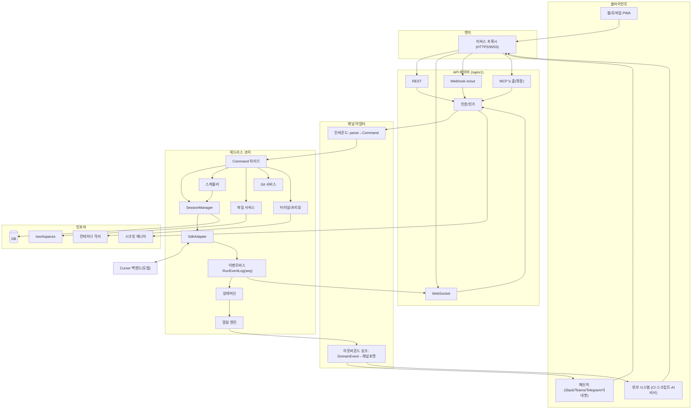
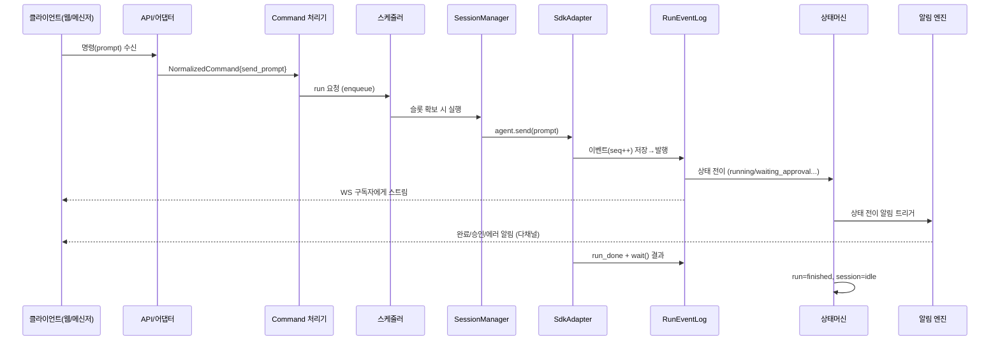

# 전체 개발계획서 — Cursor SDK 기반 원격 개발 서버

> 문서 버전: v1.2 · 최종 수정: 2026-07-04 · 대상 독자: 설계/개발/운영
> 관련: `components/*`, `glossary.md`, `18-scenarios.md`, `19-traceability.md`, `adr/*`, `CHANGELOG.md`

---

## 1. 배경과 목적

### 1.1 문제 정의
Cursor IDE가 설치된 컴퓨터를 사용할 수 없는 환경(외출·이동 중·회사 정책 등)에서도, 모바일/웹/메신저를 통해 **IDE에 준하는 개발 경험**으로 AI 에이전트와 협업하며 소프트웨어를 개발할 수 있어야 한다.

### 1.2 해결 방식
사용자가 통제하는 서버(VPS 또는 사내 온프렘)에 **Cursor SDK(Local 런타임)** 를 설치하고, 그 위에 **자체 API를 갖춘 헤드리스 서버**를 구축한다. 웹/모바일 클라이언트와 외부 메신저는 모두 이 API를 사용하는 "클라이언트"가 된다. Cursor IDE는 어디에도 설치하지 않는다.

### 1.3 목표 (Goals)
- 모바일/웹에서 파일 트리·뷰어·직접 편집·채팅·실시간 작업 관찰이 가능한 IDE급 경험
- "명령 → 진행 관찰 → 리뷰 → 커밋/푸시"의 개발 완결 루프
- 여러 프로젝트 병렬 운영, 전역 인박스와 완료 알림
- 외부 앱(메신저·봇·CI·AI 비서)이 붙을 수 있는 확장 가능한 공개 API
- 일반 클라우드 및 사내 인트라넷(온프렘) 양쪽 배포

### 1.4 비목표 (Non-Goals, 초기 범위 제외)
- 데스크톱 relay 실행 모델(전제와 충돌)
- 실시간 공동 편집(협업)은 후순위
- Cursor 계정 실제 잔여 쿼터의 실시간 조회(SDK 미보장 → 자체 사용량 미터로 대체)

### 1.5 확정된 기술 결정
- 백엔드 언어/런타임: **TypeScript / Node LTS**
- SDK 런타임: **Cursor SDK Local 런타임** (`local: { cwd }`)
- 배포 대상: **사용자 통제 VPS/온프렘 서버**

---

## 2. 핵심 설계 원칙

1. **헤드리스 코어 + API 우선.** 모든 비즈니스 로직은 코어에 있고, 웹앱조차 API를 쓰는 여러 클라이언트 중 하나다. (특권 클라이언트 없음)
2. **포트&어댑터(헥사고날).** 외부 프로토콜(HTTP/WS/메신저)은 어댑터로 격리하고, 코어는 정규 타입(`Command`/`DomainEvent`)으로만 소통한다.
3. **이벤트 소싱 기반 관찰성.** 모든 run 이벤트를 `runId+seq`로 먼저 기록(RunEventLog)한 뒤 발행한다. 리플레이·인박스·알림·모니터링이 모두 여기서 파생된다.
4. **연결과 실행의 분리.** run 수명은 클라이언트 연결(WebSocket)과 독립적이다. 연결이 끊겨도 run은 서버에서 계속되고, 재접속 시 리플레이한다.
5. **파운데이션 우선 · 이음새는 미리.** 기능 UI보다 뼈대(이벤트 로그·상태머신·스케줄러)를 먼저. 멀티프로젝트/통합의 "이음새"는 P1부터 심는다(소급 적용 비용 최소화).
6. **자원 안전.** VPS는 유한 자원이므로 동시 실행 상한·큐잉·인스턴스 dispose를 코어 차원에서 강제한다.

---

## 3. 아키텍처

### 3.1 시스템 전경



### 3.2 레이어 정의

| 레이어 | 구성요소 | 책임 |
|---|---|---|
| **클라이언트** | 웹/모바일 PWA, 메신저, 외부 시스템 | 사용자 상호작용. API 소비자. |
| **엣지** | 리버스 프록시 | TLS 종단, 라우팅. 온프렘 내부망 프록시. |
| **API** | REST, WebSocket, Webhook, (MCP), 인증/인가 | 버저닝된 공개 계약. 프로토콜 처리. |
| **어댑터** | 채널 어댑터(인/아웃바운드) | 외부 프로토콜 ↔ 정규 타입 번역. |
| **코어(헤드리스)** | SdkAdapter, SessionManager, RunEventLog, 상태머신, 스케줄러, 알림 엔진, 파일/Git/터미널 서비스, Command 처리기 | 모든 비즈니스 로직. |
| **인프라** | DB, 워크스페이스, 샌드박스, 시크릿 매니저 | 영속화·격리·비밀정보. |

### 3.3 모듈(코드) 구성 — 모노레포

```
app_cursor_server/
├─ apps/
│  ├─ server/            # 백엔드 (API + 코어 + 어댑터)
│  │  └─ src/
│  │     ├─ api/         # REST/WS/Webhook 라우팅 (얇게)
│  │     ├─ auth/        # 인증/인가
│  │     ├─ adapters/    # 채널 어댑터
│  │     ├─ core/        # 헤드리스 코어 (command, sdk, session, eventlog, state, scheduler, notif)
│  │     ├─ services/    # 파일/Git/터미널
│  │     └─ db/          # Prisma
│  └─ web/               # 프론트엔드 (React + Vite + PWA)
└─ packages/
   └─ shared/            # 정규 타입: Command, DomainEvent, 상태 enum 등
```

---

## 4. 구성요소 간 상호작용 / 작동 원리

### 4.1 대표 흐름 — 프롬프트 전송과 스트리밍



### 4.2 핵심 작동 원리 요약
- **명령 정규화**: 어떤 채널에서 오든 `NormalizedCommand`로 수렴 → 코어는 출처를 모른다.
- **이벤트 우선 기록**: SDK 스트림은 발행 전 RunEventLog에 저장 → 재접속 리플레이·감사·인박스의 단일 원천. 리플레이 커서는 실행 단위 `seq`(run별 1부터)와 **전역 단조 증가 offset**(여러 run을 가로지르는 project/global 구독용)을 함께 사용한다(상세 06).
- **상태 파생**: 인박스·알림·승인 큐·"실행 중" 뷰는 모두 상태머신 전이의 파생 결과.
- **다중 싱크 팬아웃**: 동일 `DomainEvent`가 WebSocket·웹훅·메신저 어댑터로 각각 팬아웃.
- **자원 게이팅**: 스케줄러가 동시 실행을 제한하고 초과분은 `queued`.

### 4.3 상호작용 매트릭스 (요약)

| From \ To | SdkAdapter | RunEventLog | 상태머신 | 스케줄러 | 알림 |
|---|---|---|---|---|---|
| Command 처리기 | (via Session) | — | 조회 | enqueue | — |
| SessionManager | 호출 | — | — | 콜백 | — |
| SdkAdapter | — | 이벤트 publish | — | — | — |
| RunEventLog | — | — | 전이 트리거 | — | — |
| 상태머신 | — | — | — | 슬롯 해제 | 트리거 |

---

## 5. 정보 구성 및 데이터 모델 (요약)

상세는 `components/14-data-model.md` 참조.

### 5.1 정보 계층
```
User → Workspace(선택) → Project(N) → Session(N, git 브랜치 매핑) → Run(turn) 
Project → 파일 트리 + git
User → 전역 인박스(모든 프로젝트 상태/알림/승인 집계)
```

### 5.2 핵심 엔티티
- `User`, `ApiKey`(scopes), `ChannelLink`(메신저↔앱 매핑)
- `Project`(status/pinned/lastActiveAt), `Session`(agentId/summary/branch/status/source), `Message`
- `RunEvent`(runId+seq, 리플레이 원천), `ApprovalRequest`, `Notification`, `Subscription`
- `UsageEvent`(projectId 귀속), `Secret`

### 5.3 상태 정의
- Project: `active | archived | deleted`
- Session: `idle | running | waiting_approval | error`
- Run: `queued | running | streaming | waiting_approval | finished | error | cancelled`

---

## 6. 개발 순서 (로드맵)

| 단계 | 목표(완료 시 되는 것) | 핵심 산출 |
|---|---|---|
| **P0 스파이크** | SDK 왕복 + 이벤트 로그 리플레이 검증 | SdkAdapter/RunEventLog PoC |
| **P1 코어** | 1프로젝트지만 올바른 뼈대. run이 연결과 분리되어 지속 | API 스켈레톤·인증·DB(멀티프로젝트 seam)·상태머신·RunEventLog·SessionManager·pub/sub 이음새 |
| **P2 웹 채팅** | 브라우저에서 채팅+스트림+재접속 리플레이(PWA) | 웹 슬라이스 |
| **P3 파일** | 트리+뷰어+직접 편집+경로 방어 | 파일 서비스 |
| **P4 멀티프로젝트** | 병렬 run·스케줄러·전역 인박스·푸시 알림 (+첫 메신저 어댑터 병행) | 스케줄러/인박스/알림 |
| **P5 Git/리뷰** | 커밋/브랜치/푸시/PR·diff 승인·체크포인트 | Git 서비스·diff 상태머신 |
| **P6 터미널/프리뷰** | 명령 실행·출력 스트림·라이브 프리뷰(샌드박스) | 터미널/프리뷰 |
| **P7 확장** | 음성/이미지 입력·세션 요약·MCP 노출·사내 메신저 어댑터·네이티브 앱 | 확장 |

### P1에 반드시 심을 "이음새"
헤드리스 코어 · 정규 `Command`/`DomainEvent` · pub/sub 싱크 이벤트버스 · 엔티티 `source/channel` 필드 · 머신 인증 자리 · API 버저닝(`/api/v1`). 이후 통합/멀티프로젝트를 코어 변경 없이 확장 가능.

### 방법론
- 파운데이션 우선 → 수직 슬라이스로 단계마다 "배포 가능한 상태" 유지.
- 가장 위험한 것(P0) 선검증.
- 각 단계 종료 시 완료 기준(DoD)과 카오스/부하/누수 테스트 수행(§7, §8).

---

## 7. 보안

1. **인증 필수**: 모든 REST/WS/Webhook에 인증. 사용자 JWT + 머신 API키(+스코프).
2. **경로 탈출 방어**: 파일 접근 시 `resolve` 후 프로젝트 루트 prefix 검증(`../` 차단).
3. **시크릿 격리**: `CURSOR_API_KEY`·메신저 토큰은 서버 시크릿 매니저에만. 클라이언트 노출 금지.
4. **샌드박스**: 터미널/프리뷰는 컨테이너로 격리, 프로젝트별 분리.
5. **SDK 실행 격리(중요)**: SDK Local 런타임은 프로젝트 `cwd`(호스트 경로)에서 동작하므로, AI 에이전트의 툴 실행(파일 편집·셸 명령)이 사용자 터미널보다 오히려 높은 위험을 가진 채 호스트에서 실행될 수 있다. 따라서 SDK 에이전트도 프로젝트별 격리 환경(컨테이너/전용 사용자·경로)에서 구동하는 것을 목표로 하며, 최소한 격리 수준과 완화책을 04/13/16에 명시한다. 사용자 터미널만 격리하고 에이전트는 무격리로 두는 비대칭을 피한다.
6. **SDK 설정 격리**: `settingSources: []` 유지(의도치 않은 로컬/팀 설정 로드 방지).
7. **웹훅 보안**: 서명(HMAC)·재시도·순번·타임스탬프 검증.
8. **스코프 기반 제한**: 위험 명령(삭제 등)은 특정 채널/스코프에서만 허용.
9. **전송 보안**: HTTPS/WSS 강제. 온프렘은 내부망 TLS.

상세는 각 구성요소 문서 및 `components/16-infra-deployment.md`.

---

## 8. 배포

- **런타임**: Node LTS + `@cursor/sdk`.
- **프로세스 관리**: pm2 또는 systemd.
- **프록시**: Caddy(자동 HTTPS) 또는 Nginx.
- **환경변수**: `CURSOR_API_KEY`, `JWT_SECRET`, `DATABASE_URL` 등(시크릿 매니저 경유).
- **DB**: Postgres(운영) / SQLite(개발).
- **백업**: `/workspaces`(코드+git) + DB 정기 백업.
- **온프렘**: 내부망 배포, 아웃바운드 커넥션 우선 설계(방화벽 대응).
- **관측**: run.id/agentId 로깅, 구조적 로그, 헬스체크.

상세는 `components/16-infra-deployment.md`.

---

## 9. 품질/테스트 전략 (전사 공통)

- **연결 카오스 테스트**: run 도중 연결 강제 종료 → 재접속 리플레이 정합성(중복/누락 0).
- **동시성 부하 테스트**: N개 프로젝트 동시 run → 스케줄러 상한/큐잉 준수.
- **누수 점검**: 장시간 구동 후 프로세스/메모리(dispose·LRU).
- **에러 2종 분리 검증**: `CursorAgentError`(미시작) vs `result.status==="error"`(실행 실패).
- **보안 테스트**: 경로 탈출, 인증 우회, 웹훅 위조.

상세는 [`21-test-strategy.md`](./21-test-strategy.md), [`20-nfr.md`](./20-nfr.md).

---

## 10. 보조 문서 (devplan 구성)

| 문서 | 역할 |
|---|---|
| [`glossary.md`](./glossary.md) | 용어 단일 정의 |
| [`18-scenarios.md`](./18-scenarios.md) | 사용자 시나리오 S1~S32 |
| [`19-traceability.md`](./19-traceability.md) | UR/SR → 구성요소 → 단계 추적 |
| [`20-nfr.md`](./20-nfr.md) | 비기능 수치 목표 |
| [`21-test-strategy.md`](./21-test-strategy.md) | 단계별 테스트 게이트 |
| [`22-risks.md`](./22-risks.md) | 위험 관리 대장 |
| [`conventions.md`](./conventions.md) | 개발 표준 |
| [`23-implementation-dependency.md`](./23-implementation-dependency.md) | 구현 순서·마일스톤 |
| [`adr/`](./adr/README.md) | 아키텍처 결정 기록 |
| [`CHANGELOG.md`](./CHANGELOG.md) | 문서 변경 이력 |

---

## 11. 알려진 제약 / 오픈 이슈

- Cursor 실제 잔여 쿼터 실시간 조회 불가 → 자체 사용량 미터로 대체.
- 터미널/프리뷰 샌드박스 격리 수준(컨테이너 정책) 확정 필요.
- 멀티유저/협업 권한 모델은 P7 이후 상세화.
- 하이브리드(Local+Cloud 런타임 오프로드) 채택 여부 미정.
- 모델 목록/파라미터는 변동 → `Cursor.models.list()`로 동적 조회.
