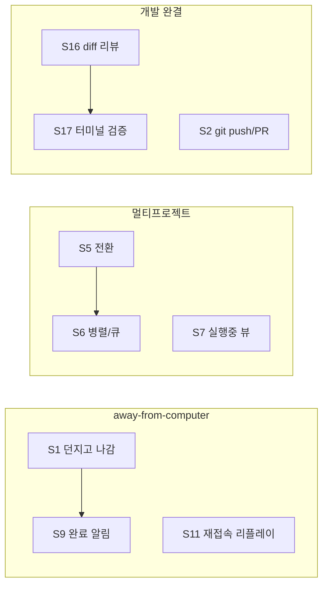

# 시나리오 카탈로그

> 상태: 확정 · 최종 수정: 2026-07-04 · 관련: `19-traceability.md`, `components/*`, `glossary.md`
> 본 문서는 코드를 포함하지 않는다.

## 1. 목적
사용자 관점의 **워크플로우 시나리오**를 ID로 정리하고, 각 시나리오가 어떤 구성요소·로드맵 단계에서 충족되는지 연결한다. 구현·검증·요구사항 추적의 기준 목록이다.

## 2. 시나리오 분류
| 그룹 | ID 범위 | 주제 |
|---|---|---|
| A | S1~S4 | 생성·진입 |
| B | S5~S8 | 다중 프로젝트 동시 진행 |
| C | S9~S13 | 모니터링·알림 (away-from-computer) |
| D | S14~S18 | 개입·리뷰·검증 |
| E | S19~S21 | 컨텍스트 유지·복귀 |
| F | S22~S25 | 유지보수·정리·자원 |
| G | S26~S28 | 입력·모바일·협업(확장) |
| H | S29~S32 | 외부 채널(메신저·API) |

---

## 3. 시나리오 상세

### A. 생성·진입

| ID | 시나리오 | 사용자 행동 | 기대 결과 | 관여 구성요소 | 단계 |
|---|---|---|---|---|---|
| S1 | 출근길 새 프로젝트 | 모바일에서 프로젝트 생성 후 첫 프롬프트 전송, 앱 종료 | 서버에서 run 지속, 완료 시 알림 | 17, 05, 08, 06, 09, 15 | P1~P4 |
| S2 | 기존 GitHub 레포 import | git URL로 프로젝트 가져오기 | clone 완료, 세션에서 이어서 개발 | 17, 11, 12, 02 | P3~P5 |
| S3 | 템플릿으로 반복 생성 | 동일 종류 프로젝트를 템플릿으로 생성 | 부트스트랩된 폴더·git | 17, 11, 12 | P3 |
| S4 | 즐겨찾기 빠른 진입 | 핀된 프로젝트 목록에서 탭 | 최근/핀 프로젝트 즉시 진입 | 02, 14, 15 | P4 |

### B. 다중 프로젝트 동시 진행

| ID | 시나리오 | 사용자 행동 | 기대 결과 | 관여 구성요소 | 단계 |
|---|---|---|---|---|---|
| S5 | A 작업 중 B 전환 | A에 긴 run 돌려놓고 B 프로젝트로 이동 | A run은 서버에서 계속, B에서 새 작업 가능 | 08, 05, 06, 15 | P4 |
| S6 | 3개 프로젝트 동시 run | 여러 프로젝트에서 동시에 프롬프트 | 스케줄러가 상한 내 병렬, 초과분 queued | 08, 07, 06 | P4 |
| S7 | 실행 중 한눈에 보기 | 전역 "실행 중" 뷰 확인 | running/streaming/waiting_approval 목록 | 07, 06, 15 | P4 |
| S8 | 세션별 병렬 갈래 | 한 프로젝트에서 기능/버그 세션 2개 | 세션↔브랜치 매핑, 독립 대화 | 05, 12, 14, 15 | P5 |

### C. 모니터링·알림

| ID | 시나리오 | 사용자 행동 | 기대 결과 | 관여 구성요소 | 단계 |
|---|---|---|---|---|---|
| S9 | 완료 푸시 알림 | 긴 작업 후 폰 알림 수신 | run_done 알림, 인박스 적재 | 09, 07, 06, 15 | P4 |
| S10 | 알림 폭주 그룹핑 | 여러 프로젝트 동시 완료 | 그룹핑·우선순위 적용 | 09 | P4 |
| S11 | 연결 끊김 후 재접속 | 지하철에서 WS 끊김→재연결 | seq/globalOffset 리플레이, 누락 없음 | 06, 02, 15 | P1~P2 |
| S12 | 진행률·단계 확인 | 작업 현황 패널 확인 | plan/tool/file_change 스트림 표시 | 06, 04, 15 | P2 |
| S13 | 실행 중 승인 대기 | AI가 위험 툴 승인 요청 | waiting_approval, 전역 승인 큐·알림 | 07, 09, 06, 15 | P1~P4 |

### D. 개입·리뷰·검증

| ID | 시나리오 | 사용자 행동 | 기대 결과 | 관여 구성요소 | 단계 |
|---|---|---|---|---|---|
| S14 | run 중 멈춤/steer | 방향 틀림 → cancel 또는 steer | run 중단 또는 추가 지시 | 05, 17, 02 | P1 |
| S15 | 직접 파일 수정 | 뷰어에서 한 줄 수정·저장 | PUT file, 트리 갱신 | 11, 02, 15 | P3 |
| S16 | 변경 리뷰 승인 | diff 보고 파일별 approve/reject | 승인분만 커밋 가능 | 12, 15, 09 | P5 |
| S17 | 테스트 실행 확인 | 터미널에서 npm test | 샌드박스 출력 스트림 | 13, 02, 15 | P6 |
| S18 | 실패 run 재시도 | error 후 재시도 | retryable 반영, 멱등 requestId | 04, 08, 17 | P1~P4 |

### E. 컨텍스트 유지·복귀

| ID | 시나리오 | 사용자 행동 | 기대 결과 | 관여 구성요소 | 단계 |
|---|---|---|---|---|---|
| S19 | 3일 만에 복귀 | 세션 목록에서 요약 카드 확인 | Session.summary 표시 | 05, 14, 15 | P1~P7 |
| S20 | 폰→태블릿 이어하기 | 다른 기기에서 동일 세션 열기 | 서버 상태 기반 동기화 | 02, 06, 15 | P2 |
| S21 | 세션 검색 | 제목/태그로 세션 찾기 | 검색 API·UI | 02, 14, 15 | P4~P7 |

### F. 유지보수·정리·자원

| ID | 시나리오 | 사용자 행동 | 기대 결과 | 관여 구성요소 | 단계 |
|---|---|---|---|---|---|
| S22 | 프로젝트 아카이브 | 끝난 프로젝트 정리 | status=archived, 목록 필터 | 07, 14, 02 | P4 |
| S23 | 사용량 확인 | 월간/프로젝트별 사용량 조회 | UsageEvent 집계 | 14, 17, 02, 15 | P4 |
| S24 | 예산 상한 도달 | 한도 초과 시 차단·경고 | quota_exceeded, 알림 | 17, 08, 09 | P4 |
| S25 | 디스크·run 정리 | 오래된 이벤트 보존 정책 | RunEvent 아카이브/삭제 | 06, 14, 16 | P4~P7 |

### G. 입력·모바일·협업(확장)

| ID | 시나리오 | 사용자 행동 | 기대 결과 | 관여 구성요소 | 단계 |
|---|---|---|---|---|---|
| S26 | 음성 프롬프트 | 음성 입력→텍스트 전송 | send_prompt with text | 15, 02, 17 | P7 |
| S27 | 스크린샷 첨부 | 에러 화면 사진 첨부 | Attachment upload→ref | 11, 02, 15 | P3~P7 |
| S28 | 오프라인 파일 열람 | PWA 오프라인에서 캐시 파일 보기 | 캐시된 트리/내용 | 15 | P2~P7 |

### H. 외부 채널(메신저·API)

| ID | 시나리오 | 사용자 행동 | 기대 결과 | 관여 구성요소 | 단계 |
|---|---|---|---|---|---|
| S29 | 메신저에서 명령 | Slack/Telegram에 `/dev prompt …` | 정규 Command→실행→요약 알림 | 10, 17, 09 | P4 |
| S30 | 메신저 진행 상황 수신 | 채팅방에 완료·에러 알림 | 아웃바운드 deliver | 10, 09, 06 | P4 |
| S31 | 사내망 pull 어댑터 | 방화벽으로 웹훅 불가 환경 | 서버가 채널 API 폴링 | 10, 16 | P7 |
| S32 | 외부 CI 스크립트 | API 키로 send_prompt 호출 | 머신 인증·스코프·멱등 | 03, 02, 17 | P4 |

---

## 4. 시나리오→흐름 요약 (대표)

---

## 5. 검증 방법
- 각 시나리오 ID는 `19-traceability.md`의 요구사항·DoD와 1:1 또는 N:1로 매핑되어야 한다.
- 로드맵 단계 완료 시 해당 단계 시나리오 subset에 대한 E2E·카오스 테스트를 `21-test-strategy.md`에 따라 수행한다.

## 6. 오픈 이슈
- S21 세션 검색: P4 필수 vs P7 확장 최종 확정.
- S28 오프라인 범위(읽기 전용 vs 일부 쓰기 큐).
