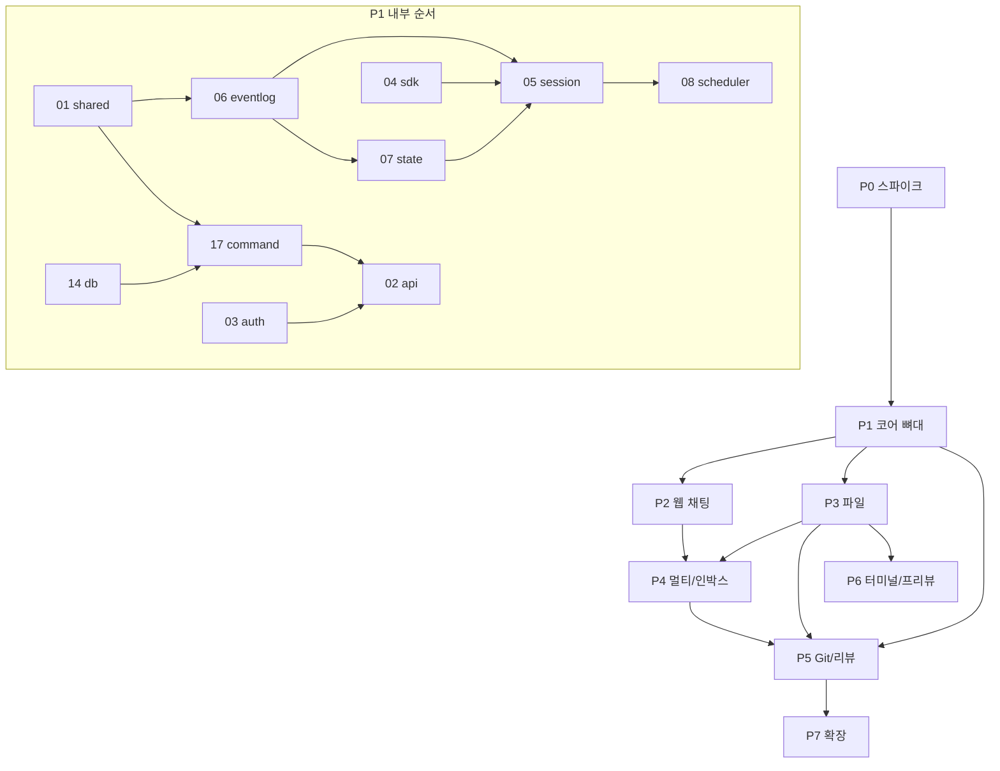

# 구현 의존성 및 마일스톤

> 상태: 확정 · 최종 수정: 2026-07-04 · 관련: `00-overall-devplan.md`, `19-traceability.md`, `21-test-strategy.md`
> 본 문서는 코드를 포함하지 않는다.

## 1. 목적
구성요소 간 **선행·후행 관계**와 로드맵(P0~P7) 단계별 **진입/종료 조건**을 한 장으로 정의한다. 병렬 작업 계획과 크리티컬 패스 파악에 사용한다.

---

## 2. 구현 의존성 그래프



---

## 3. 구성요소 선행 관계표

| 구성요소 | 선행(반드시 먼저) | 병렬 가능 |
|---|---|---|
| 01 shared | — | 모든 것의 기반 |
| 14 db (P1 subset) | 01 | 04 PoC |
| 04 sdk | P0 | 01 |
| 06 eventlog | 01, P0 | 14 |
| 07 state | 01, 06 | — |
| 05 session | 04, 06, 07 | 08 |
| 08 scheduler | 05, 07 | 17 |
| 17 command | 01, 03, 14 | 08 |
| 03 auth | 01, 14 | 02 |
| 02 api | 03, 17, 06 | 15(목업) |
| 11 file | 02, 14 | 12(init) |
| 12 git | 11 | 05 |
| 09 notif | 07, 06 | 10 |
| 10 adapters | 17, 09, 03 | — |
| 13 terminal | 11, 16 | 04(격리) |
| 15 frontend | 02 | 각 단계 슬라이스 |
| 16 infra | — | P1부터 지속 |

---

## 4. 크리티컬 패스 (최단 필수 경로)

```
P0 (04+06 PoC) → 01 → 06 → 07 → 05 → 17 → 02 → 15(P2) → P4(08+09) → P5(12)
```

터미널(P6)·메신저(P4 병행)·확장(P7)은 크리티컬 패스 밖에서 병렬 가능.

---

## 5. 마일스톤 진입·종료 조건

### P0 — 스파이크
| | 조건 |
|---|---|
| **진입** | devplan 확정, CURSOR_API_KEY, VPS/로컬 Node |
| **종료** | SDK create→send→events→wait 성공; 인메모리 seq/globalOffset 리플레이 PoC |
| **산출** | 04/06 검증 메모 |

### P1 — 코어 뼈대
| | 조건 |
|---|---|
| **진입** | P0 종료 |
| **종료** | 01~08, 14(P1), 17, 02(REST/WS), 03; CH-01, CH-04; run 연결 분리 |
| **산출** | 1프로젝트 API로 send→stream→replay |

### P2 — 웹 채팅
| | 조건 |
|---|---|
| **진입** | P1 종료 |
| **종료** | 15 채팅+작업현황; E2E UR-01~03; PWA 기본 |
| **산출** | 브라우저 데모 |

### P3 — 파일
| | 조건 |
|---|---|
| **진입** | P1 (P2 병렬 가능) |
| **종료** | 11 트리/읽기/쓰기/첨부; SEC-01 |
| **산출** | 파일 IDE 슬라이스 |

### P4 — 멀티·인박스
| | 조건 |
|---|---|
| **진입** | P2, P3 |
| **종료** | 08 본격, 09, 전역 인박스 UI; LD-01; 10 첫 채널 |
| **산출** | 멀티프로젝트 데모 |

### P5 — Git·리뷰
| | 조건 |
|---|---|
| **진입** | P3, P4 |
| **종료** | 12 스냅샷/diff/commit/push; 변경 리뷰 UI |
| **산출** | Git 완결 루프 |

### P6 — 터미널·프리뷰
| | 조건 |
|---|---|
| **진입** | P3, 16 컨테이너 |
| **종료** | 13 + SDK 샌드박스 통합(ADR-007, **shared-path**까지); SEC-04 |
| **산출** | 검증 루프 |

### P6→P7 — shared-runtime 브릿지 (ADR-007)
| | 조건 |
|---|---|
| **진입** | P6 shared-path 종료 |
| **종료** | `SDK_IN_CONTAINER` POC + SessionManager API/UI E2E green (`CURSOR_API_KEY`); ops/r01 §8 prod 전환은 **운영 결정** |
| **산출** | R-01 해소 경로 확보 (§6-4는 prod 적용 시) |

### P7 — 확장
| | 조건 |
|---|---|
| **진입** | P4~P6 대부분 |
| **종료** | 음성/이미지, MCP, 사내 pull, 네이티브(선택) |
| **산출** | 확장 릴리스 |
| **완료** | P7 — UR-15/16·S31·MCP·**Expo mobile 1~7차** |

---

## 6. 병렬 작업 권장 (P1 예시)

| 트랙 A | 트랙 B | 트랙 C |
|---|---|---|
| 01 → 06 → 07 | 14 schema | 04 (P0 이어) |
| 05 | 03 auth | 16 infra 스켈레톤 |
| 17 → 02 | — | — |

---

## 7. 오픈 이슈
- P2와 P3 병렬 시 15 파일 UI 목업만 먼저 가능 — API mock 정책.
- P6 SDK 샌드박스가 P4를 블로킹하지 않음(완화 모드).
