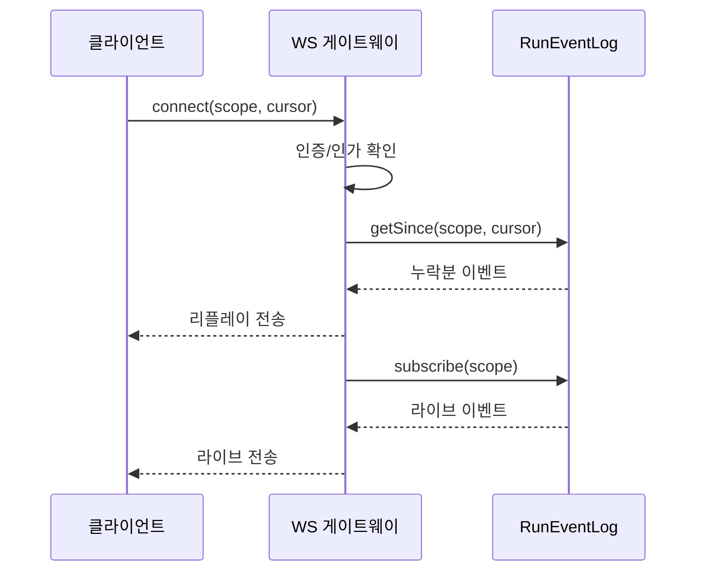

# 구성요소 상세개발계획서 — 02. API 레이어

> 위치: `apps/server/src/api` · 레이어: API · 단계: P1(REST/WS) → P4(Webhook) → P7(MCP)
> 관련 문서: 01(계약) · 03(인증) · 06(이벤트로그) · 17(Command 처리기)
> 본 문서는 코드를 포함하지 않으며, 엔드포인트·동작·규칙을 표와 절차로 기술한다.

## 1. 개요 및 책임
클라이언트/외부 시스템이 서버와 소통하는 **버저닝된 공개 계약**을 제공한다. REST(요청/응답), WebSocket(실시간 스트림 + 리플레이), Webhook(외부 이벤트 수신/발신), 선택적 MCP 노출을 담당한다. 라우트 처리부는 **얇게** 유지하고 모든 비즈니스 판단은 코어에 위임한다. 즉 API 레이어의 책임은 "프로토콜 처리 + 검증 + 위임"까지다.

## 2. 범위
- 포함: 라우팅, 요청/응답 검증·직렬화, WebSocket 연결·구독 관리, 리플레이 프로토콜, 표준 에러 응답, API 버저닝, 속도 제한.
- 제외: 비즈니스 로직(코어 서비스), 인증 판단 세부(03 문서), 채널별 번역(10 문서).

## 3. 의존성
- 상위 호출자: 클라이언트, 채널 어댑터.
- 하위 피호출자: 인증/인가, Command 처리기, RunEventLog(구독), 상태머신(조회), 파일/Git/터미널 서비스.
- 공유: `packages/shared`(명령/이벤트/에러 형식·검증 규칙).

## 4. 내부 구성 요소
| 구성 요소 | 역할 |
|---|---|
| REST 라우터 | HTTP 경로별 요청 수신·검증·코어 위임·응답 |
| WebSocket 게이트웨이 | 연결 수립, 구독 범위 관리, 리플레이 후 라이브 전환 |
| Webhook 엔드포인트 | 외부 인바운드 수신(어댑터 위임), 아웃바운드 발신 트리거 |
| 구독 레지스트리 API | 아웃바운드 이벤트 구독 등록/해제 |
| 요청 검증기 | 공유 검증 규칙을 경계에서 적용 |
| 에러 변환기 | 내부 AppError를 HTTP 상태/표준 응답으로 매핑 |

## 5. 데이터 구조 및 필드

### 5.1 WebSocket 연결 레지스트리 항목
| 필드 | 자료형 | 의미 |
|---|---|---|
| connectionId | 문자열 | 연결 식별자 |
| authContext | 인증 컨텍스트 | 연결 소유자·스코프 |
| scope | session/project/global | 구독 범위 |
| scopeId | 문자열(선택) | 대상 세션/프로젝트 식별자 |
| cursorKind | seq / globalOffset | 이 구독이 사용하는 리플레이 커서 종류 |
| lastSentCursor | 정수 | 마지막으로 전송한 커서값(seq 또는 globalOffset) |

> 커서 종류 규칙: scope가 run/session이면 `seq`, project/global이면 `globalOffset`을 커서로 사용한다(상세 06).

### 5.2 표준 에러 응답
| 필드 | 자료형 | 의미 |
|---|---|---|
| error.code | 문자열 | 기계 판독 코드 |
| error.message | 문자열 | 설명 |
| error.retryable | 참/거짓 | 재시도 가능 여부 |

## 6. 엔드포인트 명세 (REST, 접두어 `/api/v1`)
| 메서드 | 경로 | 목적 | 요청 요약 | 응답 요약 | 필요 스코프 |
|---|---|---|---|---|---|
| POST | /projects | 프로젝트 생성(빈/템플릿/git-import) | name, template?, gitUrl? | 생성된 프로젝트 | project:write |
| GET | /projects | 목록(status/pinned 필터·정렬) | 쿼리 필터 | 프로젝트 배열 | project:read |
| GET | /projects/:id | 단건 조회 | — | 프로젝트 | project:read |
| PATCH | /projects/:id | 이름변경/아카이브/핀 | 변경 필드 | 갱신 결과 | project:write |
| GET | /projects/:id/tree | 폴더 트리 | — | 트리 구조 | project:read |
| GET | /projects/:id/file | 파일 내용 조회 | path 쿼리 | 내용 + 언어 | project:read |
| PUT | /projects/:id/file | 파일 저장 | path, content | 저장 결과 | project:write |
| POST | /projects/:id/attachments | 첨부(이미지/파일) 업로드 | 멀티파트 바이너리 | 첨부 ref | project:write |
| GET | /projects/:id/attachments/:ref | 첨부 조회/다운로드 | — | 바이너리 | project:read |
| GET | /projects/:id/search | 프로젝트 내 검색 | q 쿼리 | 매치 목록 | project:read |
| POST | /projects/:id/sessions | 세션 생성 | model?, title? | 세션(agentId) | prompt:send |
| GET | /sessions/:sid | 세션 조회 | — | 세션 상태·요약 | project:read |
| GET | /sessions/:sid/messages | 대화 기록 | limit, before(커서) | messages, hasMore | project:read |
| POST | /sessions/:sid/messages | 프롬프트 전송 | text, attachments? | runId | prompt:send |
| POST | /runs/:rid/cancel | 실행 취소 | — | 결과 | run:cancel |
| POST | /runs/:rid/steer | 진행 중 추가 지시 | text | 결과 | prompt:send |
| GET | /projects/:id/diff | 변경 diff | 범위 | diff 데이터 | project:read |
| POST | /projects/:id/commit | 커밋 | 메시지, 파일 | 커밋 결과 | git:write |
| POST | /projects/:id/push | 원격 푸시 | 원격/브랜치 | 결과 | git:write |
| POST | /projects/:id/pr | PR 생성 | 제목/본문 | PR 정보 | git:write |
| POST | /approvals/:aid/resolve | 승인 처리 | decision | 결과 | approval:resolve |
| GET | /inbox | 전역 인박스 | 필터 | 인박스 항목 | project:read |
| GET | /usage | 사용량 조회 | range | 집계 | project:read |
| GET | /models | 모델 목록 | — | 모델 배열 | project:read |
| POST | /webhooks/:channel | 인바운드 웹훅 수신 | 채널 payload | 수락 응답 | (채널 서명) |
| POST | /subscriptions | 아웃바운드 구독 등록 | 채널/대상/필터 | 구독 | project:write |
| POST | /commands | 정규 명령 디스패치 | kind별 payload(01) | 처리 결과 | kind별 스코프 |
| POST | /projects/:id/preview | 프리뷰 토큰 발급 | port(허용 범위 내) | token, previewPath | terminal:exec |
| GET | /preview/:token/* | 프리뷰 HTTP 프록시 | — | 업스트림 응답 | (토큰) |
| GET | /health | 헬스·샌드박스 정책 | — | status, exec, sandbox | (없음) |

> P6 `exec_command`는 `POST /commands` body `{ kind: "exec_command", projectId, command, cwd? }`로 전달한다(17). 터미널 대화형 exec는 아래 WS를 사용한다.

## 7. WebSocket 명세
- 경로: `/api/v1/stream`. 쿼리 파라미터: scope(session/project/global), id(대상 식별자), cursor(정수·선택·재접속 시 마지막 커서값).
- **P6 터미널**: `/api/v1/projects/:id/terminal?token=…` — exec/stdin/stdout·stderr/exit 스트림. close code는 `TERMINAL_WS_CLOSE`(01): 4403 forbidden, 4410 archived, 1001 shutdown.
- **P6 프리뷰 HMR**: `/api/v1/preview/:token/ws` — 발급된 previewPath 하위 WS 업그레이드 프록시(UR-10).
- **인증 방식(브라우저 제약 고려)**: 브라우저 WebSocket은 임의 Authorization 헤더를 설정할 수 없으므로, 접근 토큰을 (a)연결 URL의 단기 토큰 쿼리 파라미터, (b)WebSocket 서브프로토콜 헤더, (c)연결 직후 최초 인증 메시지 중 하나로 전달받아 검증한다. URL 토큰 방식은 단기·1회성으로 발급하고 로그에 남기지 않는다.
- 연결 절차:
  1. 연결 요청 수신 시 위 방식으로 인증을 검증한다(실패 시 연결 거부).
  2. 요청한 scope에 대한 접근 권한을 확인한다.
  3. cursor가 주어지면 scope별 커서 종류(run/session=seq, project/global=globalOffset)에 따라 RunEventLog에서 커서 초과 이벤트를 조회하여 순서대로 전송(리플레이)한다.
  4. 리플레이 완료 후 실시간 구독으로 전환하여 이후 이벤트를 전송한다.
  5. 전송할 때마다 연결 레지스트리의 lastSentCursor를 갱신한다.
- 클라이언트→서버 메시지는 ping과 구독 변경만 허용한다. 명령은 REST로 받는 것을 원칙으로 한다(멱등성·검증 일관성).

## 8. 처리 흐름 (WS 리플레이)

## 9. 상호작용
- 인바운드 명령: REST/웹훅 수신 → 검증 → (웹훅은 어댑터 번역) → Command 처리기 호출.
- 아웃바운드 이벤트: WebSocket은 RunEventLog 구독자의 하나이며, 웹훅/메신저도 동일 이벤트를 다른 싱크로 소비한다.

## 10. 예외/에러 처리
| 상황 | HTTP 상태 | 비고 |
|---|---|---|
| 검증 실패 | 400 | AppError code=validation_failed |
| 미인증 | 401 | 토큰 없음/무효 |
| 스코프 부족 | 403 | 인가 실패 |
| 자원 없음 | 404 | 프로젝트/세션/실행 미존재 |
| 동시 실행 초과(큐잉) | 202 또는 429 | queued 수용은 202, 거부는 429 |
| 서버 오류 | 500 | 내부 예외 |
- 응답에 retryable 플래그를 포함해 클라이언트 재시도 판단을 돕는다.

## 11. 보안 고려사항
- 모든 라우트·WS 연결에 인증을 필수로 적용한다.
- CORS 허용 출처를 명시적으로 제한한다.
- 속도 제한(사용자/IP/API키 단위)을 적용한다.
- WS 재접속 리플레이 시에도 scope 접근 권한을 재확인한다.
- 웹훅 수신은 채널 서명 검증을 통과해야 처리한다.

## 12. 구성/설정값
- 기본 페이지 크기, 최대 요청 본문 크기, WS 하트비트 주기(권장 30초), 속도 제한 임계값을 설정값으로 둔다.
- API 버전은 경로 접두어 `/api/v1`로 고정한다.

## 13. 테스트 전략
- 각 엔드포인트의 정상/검증실패/권한부족 응답 확인.
- WS 카오스: 연결 끊김→재접속, lastSeq 경계값(0, 최신값, 미래값) 처리 확인.
- 속도 제한·429 동작 확인.
- 리플레이 정합성: 리플레이+라이브 사이에 이벤트 중복/누락이 없는지 확인.

## 14. 개발 순서 / 완료 기준(DoD)
- P1: REST 핵심(프로젝트/세션/메시지) + WS 스트림·리플레이. DoD: 채팅 왕복과 재접속 리플레이가 정상 동작.
- P4: Webhook 수신/발신 + 구독 등록.
- P7: **MCP 노출** — Streamable HTTP `/api/v1/mcp`, tools: `create_project`, `send_prompt`, `get_status`, `approve_run`, `cancel_run`, `exec_command` (CommandHandler 위임, Bearer 인증). tool별 logical key `mcp:{hdr}:{rpcId}:{tool}` → UUID v5 `requestId`. production `MCP_ENABLED` opt-in (`ops/mcp-mode.md`).
- **구현 (UR-15 5차):** `POST /projects/:id/attachments` — `@fastify/multipart` + JSON `{ dataBase64, mime }` dual. E2E `POST /api/v1/e2e/session/seed` (SDK 없이 세션 행 생성, S26 UI용).
- **구현 (UR-15 6차+2차):** `GET /sessions/:sid/messages` limit/before 페이지네이션 (`before` optimistic id → 400). `POST /api/v1/stt/transcribe` stub(`STT_STUB`) 또는 **STT_API_URL** upstream.
- **구현 (P7 mobile 2차):** REST/Command 경로 `X-Channel-Source` 헤더 → `command.source` (`web`|`mobile`|…). `channel-source.test.ts`.
- **구현 (P7 mobile 3차):** `POST /api/v1/push/expo-subscribe` · `expo-unsubscribe` — Expo Push 토큰 등록. `PushService.sendExpoToUser` → `exp.host`.
- **구현 (P7 mobile 4차):** `/health` → `push.webPush` · `push.expo`. Expo payload `kind`·`projectId`·`sessionId`.

## 15. 오픈 이슈
- API 스펙 자동 문서화 도구 채택 여부.
- 모바일 네트워크 특성상 WS 외 SSE 병행 필요 여부.
