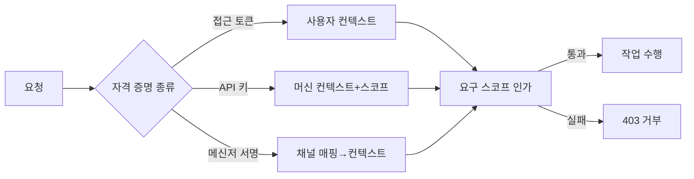

# 구성요소 상세개발계획서 — 03. 인증/인가

> 위치: `apps/server/src/auth` · 레이어: API · 단계: P1(사용자) → P4(머신/채널)
> 관련 문서: 02(API) · 10(채널 어댑터) · 17(Command 처리기) · 14(데이터 모델)
> 본 문서는 코드를 포함하지 않는다.

## 1. 개요 및 책임
서버는 인터넷/사내망에 노출되므로 모든 요청의 **신원 확인(인증)** 과 **권한 판단(인가)** 을 담당한다. 사용자 클라이언트(웹/모바일)와 머신 클라이언트(메신저 봇·CI·외부 시스템)를 **하나의 스코프 기반 인가 모델**로 통합한다. 인증 결과는 인증 컨텍스트로 만들어 요청에 주입하고, 위험 작업은 스코프로 통제한다.

## 2. 범위
- 포함: 사용자 토큰 발급/검증, API 키/서비스 계정 검증, 스코프 기반 인가 판단, 메신저 사용자↔앱 사용자 매핑, 인증 컨텍스트 생성.
- 제외: 사용자 계정 관리 화면, 시크릿 저장 구현(16 문서), 채널별 서명 검증 알고리즘(10 문서와 공유).

## 3. 의존성
- 상위 호출자: API 레이어(미들웨어로 장착), 채널 어댑터.
- 하위 피호출자: 데이터 모델(User/ApiKey/ChannelLink), 시크릿 매니저.
- 공유: `packages/shared`(Scope 열거값).

## 4. 내부 구성 요소
| 구성 요소 | 역할 |
|---|---|
| 토큰 발급기 | 로그인 성공 시 접근 토큰·갱신 토큰 발급 |
| 토큰 검증기 | 요청 토큰의 유효성·만료 확인, 사용자 컨텍스트 생성 |
| API 키 검증기 | 제시된 키를 해시 조회하여 머신 컨텍스트·스코프 로드 |
| 인가 판단기 | 인증 컨텍스트가 요구 스코프를 보유하는지 확인 |
| 채널 신원 해석기 | 메신저 외부 사용자 식별자를 앱 사용자로 매핑 |

## 5. 데이터 구조 및 필드

### 5.1 인증 컨텍스트(AuthContext)
| 필드 | 자료형 | 필수 | 의미 |
|---|---|---|---|
| subjectType | user / machine | 필수 | 주체 종류 |
| userId | 문자열 | 필수 | 소유 사용자(머신도 사용자에 귀속) |
| scopes | Scope 배열 | 필수 | 허용 권한 범위 |
| channel | ChannelSource | 선택 | 머신/메신저 출처 |
| externalUserId | 문자열 | 선택 | 메신저 원 사용자 식별자 |

### 5.2 저장 항목(요약, 상세는 14 문서)
| 항목 | 주요 필드 | 비고 |
|---|---|---|
| ApiKey | hashedKey, scopes, expiresAt, userId | 원문은 발급 시 1회만 노출, 저장은 해시 |
| ChannelLink | channel, externalUserId, userId | 메신저 사용자 매핑 |

## 6. 기능(동작) 명세

### 6.1 사용자 인증
- 목적: 사용자 토큰으로 신원 확인.
- 입력: 요청 헤더의 접근 토큰(REST) 또는 WebSocket 인증 채널(아래).
- 처리 절차:
  1. 토큰 서명·만료를 검증한다.
  2. 유효하면 사용자 식별자·스코프로 AuthContext(subjectType=user)를 만든다.
  3. 만료 시 만료 응답을 반환하여 갱신 토큰 흐름을 유도한다.
- 출력: AuthContext 또는 인증 실패.
- 오류: 무효 토큰→미인증, 만료→만료 응답.

#### 6.1.1 WebSocket 인증(브라우저 제약)
- 브라우저 WebSocket은 임의 Authorization 헤더 설정이 불가하므로, 다음 중 하나로 토큰을 받아 동일 검증을 수행한다.
  1. 연결 URL의 **단기·1회성 토큰** 쿼리 파라미터(로그 미기록).
  2. WebSocket **서브프로토콜** 헤더에 토큰 삽입.
  3. 연결 직후 **최초 인증 메시지**로 토큰 전달(그 전까지 이벤트 미전송).
- 단기 토큰 방식은 짧은 수명·재사용 불가로 발급하며, 재접속 시 재발급한다. (02의 WS 명세와 정합.)

### 6.2 머신 인증
- 목적: API 키로 머신 클라이언트 신원 확인.
- 처리 절차:
  1. 제시된 키를 해시하여 저장된 해시와 대조한다.
  2. 일치하고 미만료이면 키에 부여된 스코프로 AuthContext(subjectType=machine)를 만든다.
- 오류: 불일치/만료→미인증.

### 6.3 채널 신원 해석
- 목적: 메신저에서 온 명령의 외부 사용자 식별자를 앱 사용자로 매핑.
- 처리 절차:
  1. 어댑터가 채널 서명 검증을 통과한 뒤 externalUserId를 제공한다.
  2. ChannelLink에서 (channel, externalUserId)로 앱 사용자를 조회한다.
  3. 매핑이 있으면 AuthContext를 만든다. 없으면 링크 안내를 반환하고 명령을 거부한다.

### 6.4 인가 판단
- 목적: 특정 작업 수행 전 권한 확인.
- 처리 절차:
  1. 대상 작업이 요구하는 스코프를 확인한다.
  2. AuthContext.scopes에 포함되지 않으면 거부한다.
- 규칙: 위험 작업(git:write, terminal:exec 등)은 채널별 허용 목록으로 추가 제한할 수 있다.

## 7. 처리 흐름

## 8. 상호작용
- API 미들웨어가 인증 후 AuthContext를 요청에 주입한다.
- Command 처리기와 위험 작업(파일 삭제/커밋/터미널)은 인가 판단기를 호출한다.
- 사용량(UsageEvent)·알림 대상은 userId 기준으로 귀속된다.

## 9. 예외/에러 처리
| 상황 | 결과 |
|---|---|
| 미인증 | 401 |
| 스코프 부족 | 403 |
| 토큰 만료 | 만료 응답(갱신 유도) |
| 메신저 미링크 사용자 | 명령 거부 + 링크 안내 |

## 10. 보안 고려사항
- API 키는 해시로만 저장하고 회전·만료를 지원한다.
- 최소 권한 스코프를 기본으로 부여한다.
- 메신저 위험 명령을 제한한다(채널 허용 목록).
- 로그인/키 검증에 속도 제한을 적용하고 갱신 토큰을 회전한다.

## 11. 구성/설정값
- 접근 토큰 수명(권장 짧게), 갱신 토큰 수명, API 키 기본 만료, 채널별 허용 스코프 목록을 설정값으로 둔다.

## 12. 테스트 전략
- 엔드포인트↔요구 스코프 매트릭스 전수 확인.
- 토큰 만료/갱신/무효화 시나리오.
- 메신저 매핑 유무에 따른 수용/거부.
- 위험 명령의 채널별 제한 동작.

## 13. 개발 순서 / 완료 기준(DoD)
- P1: 사용자 토큰 인증 + 인가 판단. DoD: 미인증 차단, 스코프 부족 차단 확인.
- P4: API 키/서비스 계정 + 채널 매핑.

## 14. 오픈 이슈
- 조직/워크스페이스 롤 기반 권한(멀티유저) — P7.
- 외부 OAuth 제공자 연동 여부.
