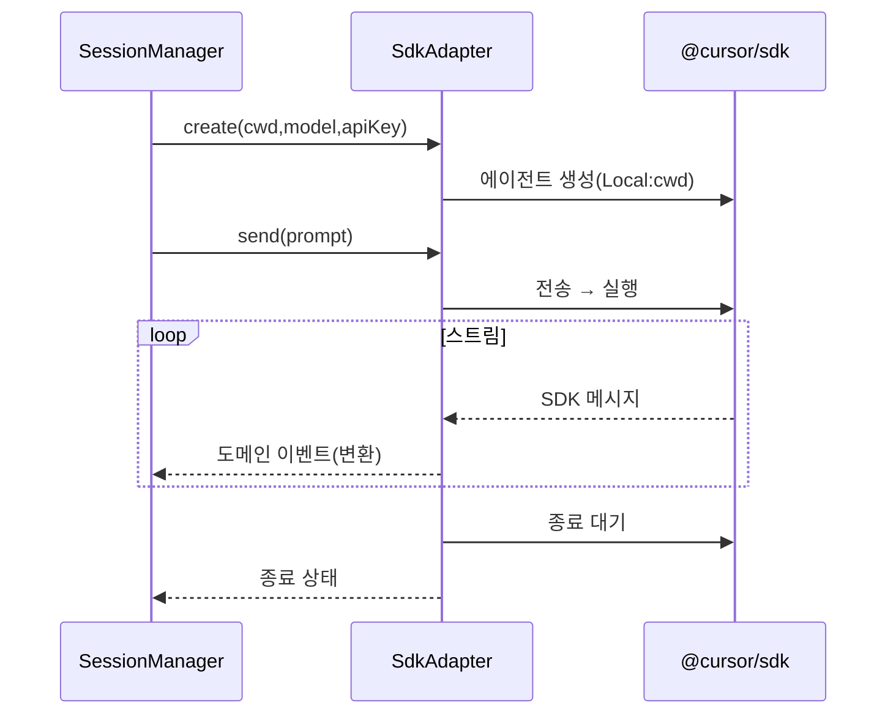

# 구성요소 상세개발계획서 — 04. SdkAdapter

> 위치: `apps/server/src/core/sdk` · 레이어: 코어 · 단계: P0(PoC) → P1
> 관련 문서: 05(SessionManager) · 06(이벤트로그) · 13(샌드박스) · 16(운영 보안)
> 본 문서는 코드를 포함하지 않는다.

## 1. 개요 및 책임
`@cursor/sdk`를 감싸 **나머지 코어가 SDK 세부에 직접 의존하지 않게** 하는 유일한 경계다. SDK의 에이전트 생성·전송·재개·취소와 실행 스트림·종료 대기를 래핑하고, SDK가 뱉는 스트림 메시지를 정규 도메인 이벤트로 변환한다. SDK 사용 규칙(런타임 명시, 종료 대기 보장, 자원 해제, 에러 2종 구분)을 이 지점에서 강제한다.

## 2. 범위
- 포함: SDK 호출 래핑, Local 런타임 옵션 구성, 스트림 메시지→도메인 이벤트 변환, 에러 분류, 모델 목록 조회.
- 제외: 에이전트 인스턴스 생명주기 캐시(05), 이벤트 저장(06), 동시 실행 제어(08).

## 3. 의존성
- 외부: `@cursor/sdk`, Cursor API 키(시크릿 매니저 경유).
- 상위 호출자: SessionManager.
- 발행 대상: 변환된 도메인 이벤트를 SessionManager를 거쳐 RunEventLog로 전달.
- 공유: `packages/shared`(도메인 이벤트·에러 형식).

## 4. 내부 구성 요소
| 구성 요소 | 역할 |
|---|---|
| 에이전트 팩토리 | Local 런타임 옵션을 구성하여 에이전트를 생성/재개 |
| 실행 핸들 래퍼 | 전송 결과 실행을 감싸 스트림/대기/취소 동작 제공 |
| 이벤트 변환기 | SDK 스트림 메시지를 정규 도메인 이벤트로 매핑 |
| 에러 분류기 | 미시작 실패와 실행 실패를 구분하여 표준화 |
| 모델 조회기 | 사용 가능 모델 목록과 파라미터를 조회 |

## 5. 데이터 구조 및 필드

### 5.1 에이전트 생성 사양
| 필드 | 자료형 | 필수 | 의미 |
|---|---|---|---|
| cwd | 문자열(절대경로) | 필수 | 프로젝트 작업 디렉터리 |
| model | 문자열 | 필수 | 사용할 모델 식별자 |
| apiKey | 문자열 | 필수 | Cursor API 키(명시 주입) |
| projectId | 문자열 | 선택 | ADR-007 shared-runtime-pending 시 컨테이ner 준비 검증용 |

### 5.1.1 런타임 모드 (ADR-007, ops/r01)
| runtimeMode | 의미 |
|---|---|
| host | SDK Local on 호스트 cwd (기본) |
| shared-runtime-pending | docker 컨테이ner 준비 + **Node 런타임 검증** 후 호스트 SDK (POC 1~2단계) |
| shared-runtime | docker exec로 컨테이ner 내부 `@cursor/sdk` (`SDK_IN_CONTAINER=true`, sandbox-sdk 이미지) |

### 5.1.2 ContainerSdkBridge (shared-runtime POC 3)
| 구성 | 역할 |
|---|---|
| `apps/server/docker/sandbox-sdk/` | `@cursor/sdk` 포함 샌드박스 이미지·runner 스크립트 |
| `container-sdk-bridge.ts` | `docker exec`로 create/send, NDJSON→도메인 이벤트 |
| SessionManager 계약 | `streamEvents()`에 `run_done` 없음; `wait()`가 종료 상태 확정 |
| API 키 | stdin JSON 대신 `CURSOR_API_KEY` env (`docker exec -e`) |
| exec timeout | `EXEC_TIMEOUT_MS` → docker exec SIGTERM + **run_error** 이벤트 |

### 5.2 에이전트 핸들(개념적 보유값)
| 속성/동작 | 설명 |
|---|---|
| agentId | 생성/재개된 에이전트 식별자 |
| 전송 동작 | 프롬프트를 보내 실행 핸들을 반환 |
| 해제 동작 | 내부 SDK 자원을 회수 |

### 5.3 실행 핸들(개념적 보유값)
| 속성/동작 | 설명 |
|---|---|
| runId | 실행 식별자 |
| 이벤트 열람 동작 | 스트림을 도메인 이벤트의 비동기 순회로 제공 |
| 종료 대기 동작 | 실행 종료 상태를 반환(항상 호출) |
| 취소 동작 | 지원 시 실행 취소 |
| 지원 여부 조회 | cancel/conversation 등 작업 지원 여부 확인 |

## 6. 기능(동작) 명세

### 6.1 에이전트 생성
- 목적: 특정 프로젝트 디렉터리에 대한 SDK 에이전트 생성.
- 처리 절차:
  1. 생성 사양을 받아 **Local 런타임(cwd 명시)** 으로 SDK 에이전트를 생성한다. 런타임을 생략하지 않는다.
  2. 설정 소스를 비활성(빈 값)으로 두어 로컬/팀 설정 자동 로드를 방지한다.
  3. 생성된 에이전트 식별자를 로깅한다.
- 오류: 생성 실패는 미시작 실패로 분류.

### 6.2 에이전트 재개
- 목적: 저장된 에이전트 식별자로 기존 세션 복원.
- 처리 절차:
  1. 식별자와 API 키로 재개한다.
  2. 인라인 MCP 서버가 필요하면 재개 시 다시 전달한다(재개 시 비영속이므로).

### 6.3 프롬프트 전송
- 목적: 프롬프트를 실행으로 변환.
- 처리 절차:
  1. 프롬프트(및 첨부 참조)를 전송하여 실행 핸들을 얻는다.
  2. 실행 식별자와 에이전트 식별자를 즉시 로깅한다(스트림 시작 전).
- 출력: 실행 핸들.

### 6.4 이벤트 변환
- 목적: SDK 스트림을 정규 도메인 이벤트로 변환.
- 처리 절차:
  1. 스트림을 순회하며 메시지 종류별로 매핑한다.
  2. 어시스턴트 텍스트→assistant, 툴 호출→tool, 계획→plan, 파일 변경→file_change, 승인 요청→approval_required로 변환한다.
  3. 변환 불가한 미지원 메시지는 무시하되 로깅한다.
- 사후조건: 스트림 종료 후 반드시 종료 대기를 호출한다.

### 6.5 종료 대기
- 목적: 실행의 최종 상태 확정.
- 규칙: 스트림 사용 여부와 무관하게 **항상 호출**한다. 미호출 시 종료 판정 불가·감시자 누수가 발생한다.
- 출력: finished/error/cancelled 중 하나.

### 6.6 취소
- 처리 절차: 지원 여부를 먼저 확인하고 지원 시에만 취소를 요청한다.

### 6.7 모델 목록 조회
- 목적: 유효 모델 식별자·파라미터 제공(하드코딩 방지).

## 7. 처리 흐름

## 8. 상호작용
- SessionManager가 생성/재개/전송을 호출하고 반환된 도메인 이벤트를 RunEventLog로 넘긴다.
- 취소·재시도 정책은 스케줄러/클라이언트가 결정하며 어댑터는 실행만 담당한다.

## 9. 예외/에러 처리
| 실패 유형 | 판정 | 표준화 |
|---|---|---|
| 미시작 실패(인증/설정/네트워크) | 생성/전송 단계 예외 | error 이벤트 errorKind=startup, retryable 보존 |
| 실행 실패 | 종료 대기 결과가 error | run_done status=error |
- 재시도 가능 여부와 재시도 대기 시간 정보를 상위(스케줄러/클라이언트)에 보존·전달한다.

## 10. 보안 고려사항
- API 키를 명시적으로 주입하고 환경변수 암묵 의존을 피한다.
- 설정 소스를 비활성으로 유지한다.
- 인라인 MCP 서버 비밀값은 재개 시마다 재전달하며 로깅하지 않는다.
- **실행 격리(중요)**: Local 런타임은 프로젝트 `cwd`(호스트 경로)에서 에이전트를 구동하므로, 에이전트의 툴 실행(파일 편집·셸 명령)이 호스트 권한으로 수행될 수 있다. 이는 사용자 터미널(13)만 격리하고 에이전트는 무격리로 두는 비대칭을 낳는다. 따라서 SDK 에이전트도 프로젝트별 격리 환경에서 구동하는 것을 목표로 한다. 구현 옵션:
  1. 프로젝트별 격리 컨테이너 내부에 `cwd`를 두고 그 안에서 SDK를 구동(13 샌드박스와 동일 격리 정책 공유).
  2. 컨테이너 구동이 불가한 초기 단계에서는 최소한 전용 OS 사용자·제한 경로·네트워크 이그레스 제한으로 완화하고, 이 한계를 명시한다.
- 격리 수준 결정은 13(샌드박스)·16(운영 보안)과 정합을 맞춘다.

## 11. 구성/설정값
- 기본 모델 식별자, 스트림 최대 유휴 시간(하트비트/타임아웃), 변환기 매핑 표를 설정으로 둔다.

## 12. 테스트 전략
- P0 통합: 생성→전송→이벤트→종료 대기 왕복.
- 에러 2종 분리 단위 테스트(미시작 vs 실행실패).
- 취소/미지원 작업 가드.
- 미지원 스트림 메시지 무시·로깅 확인.

## 13. 개발 순서 / 완료 기준(DoD)
- P0: 왕복 PoC. DoD: 텍스트 스트림 수신 + 종료 상태 획득.
- P1: 에러 분류·자원 해제·모델 목록 확정.

## 14. 오픈 이슈
- 파일 변경 이벤트의 취득 정밀도(툴 호출 파싱 대 파일시스템 워처 병행).
- Cloud 런타임 하이브리드 도입 시 어댑터 확장 형태.
