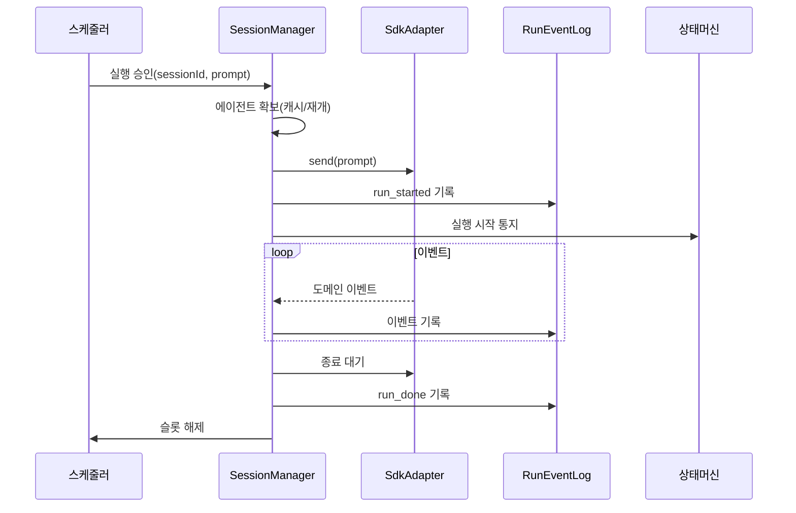

# 구성요소 상세개발계획서 — 05. SessionManager

> 위치: `apps/server/src/core/session` · 레이어: 코어 · 단계: P1
> 관련 문서: 04(SdkAdapter) · 06(이벤트로그) · 07(상태머신) · 08(스케줄러)
> 본 문서는 코드를 포함하지 않는다.

## 1. 개요 및 책임
세션(대화 단위)과 SDK 에이전트 인스턴스의 **생명주기 관리자**다. 세션 식별자와 에이전트 식별자의 매핑을 관리하고, 살아있는 에이전트 인스턴스를 메모리에 캐시하며, 없으면 재개(resume)로 복원한다. 실행 요청을 받아 SdkAdapter로 전송하고, 반환된 도메인 이벤트를 RunEventLog로 흘린다. 사용하지 않는 인스턴스를 회수하여 자원 누수를 방지한다.

## 2. 범위
- 포함: 세션 생성/조회, 에이전트 인스턴스 캐시 및 재개, 프롬프트 실행 개시, 이벤트 중계, 인스턴스 해제(LRU).
- 제외: SDK 세부 호출(04), 동시 실행 상한 결정(08), 이벤트 저장(06), 상태 전이 판정(07).

## 3. 의존성
- 상위 호출자: Command 처리기, 스케줄러.
- 하위 피호출자: SdkAdapter, RunEventLog, 상태머신, 데이터 모델.

## 4. 내부 구성 요소
| 구성 요소 | 역할 |
|---|---|
| 세션 레지스트리 | 세션 식별자↔에이전트 식별자·메타 매핑 |
| 인스턴스 캐시(LRU) | 살아있는 에이전트 핸들을 최근 사용 기준으로 보관 |
| 재개 로더 | 캐시에 없을 때 저장된 에이전트 식별자로 복원 |
| 실행 개시기 | 프롬프트 전송·이벤트 중계·종료 처리 총괄 |
| 회수기 | 유휴/초과 인스턴스를 해제 |

## 5. 데이터 구조 및 필드

### 5.1 세션 레지스트리 항목
| 필드 | 자료형 | 필수 | 의미 |
|---|---|---|---|
| sessionId | 문자열 | 필수 | 세션 식별자 |
| projectId | 문자열 | 필수 | 소속 프로젝트 |
| agentId | 문자열 | 필수 | SDK 에이전트 식별자 |
| model | 문자열 | 필수 | 사용 모델 |
| cwd | 문자열 | 필수 | 프로젝트 작업 디렉터리 |
| lastUsedAt | 시각 | 필수 | 최근 사용 시각(LRU 기준) |

### 5.2 인스턴스 캐시 항목
| 필드 | 자료형 | 의미 |
|---|---|---|
| agentId | 문자열 | 캐시 키 |
| handle | 에이전트 핸들 | 살아있는 SDK 핸들 |
| activeRunCount | 정수 | 진행 중 실행 수(0일 때만 회수 대상) |
| lastUsedAt | 시각 | LRU 갱신용 |

## 6. 기능(동작) 명세

### 6.1 세션 생성
- 목적: 프로젝트에 대한 새 세션과 에이전트 생성.
- 처리 절차:
  1. 프로젝트의 cwd·모델을 확인한다.
  2. SdkAdapter로 에이전트를 생성한다.
  3. 세션 레지스트리와 데이터 모델(Session)에 agentId·메타를 저장한다.
  4. 세션 상태를 idle로 초기화한다.
- 출력: 세션 식별자와 에이전트 식별자.

### 6.2 에이전트 확보(get-or-resume)
- 목적: 실행 전 살아있는 에이전트 핸들 확보.
- 처리 절차:
  1. 인스턴스 캐시에서 agentId를 조회한다.
  2. 있으면 lastUsedAt을 갱신하고 반환한다.
  3. 없으면 재개 로더로 복원하여 캐시에 넣고 반환한다.
  4. 캐시가 상한을 초과하면 회수기를 호출한다.

### 6.3 실행 개시
- 목적: 프롬프트를 실행으로 전환하고 이벤트를 중계.
- 사전조건: 스케줄러가 실행 슬롯을 승인했다.
- 처리 절차:
  1. 에이전트를 확보한다.
  2. activeRunCount를 1 증가시킨다.
  3. SdkAdapter로 프롬프트를 전송하여 실행 핸들을 얻는다.
  4. run_started 이벤트를 RunEventLog에 기록한다. (상태 전이는 상태머신이 이 이벤트를 소비하여 수행하며, SessionManager가 상태머신을 직접 호출해 이중 전이시키지 않는다 — 07 참조.)
  5. 실행 핸들의 이벤트를 순회하며 각 도메인 이벤트를 RunEventLog에 기록한다.
  6. 종료 대기를 호출하여 최종 상태를 얻고 run_done 이벤트를 기록한다.
  7. 대화 메시지를 데이터 모델(Message)에 저장한다.
  8. activeRunCount를 1 감소시키고 lastUsedAt을 갱신한다.
  9. 스케줄러에 슬롯 해제를 통지한다.
- 사후조건: run 상태가 종료 상태로 확정된다.

### 6.4 취소/추가 지시(steer)
- 취소: 대상 실행의 SDK 취소를 호출하고 상태를 cancelled로 유도.
- 추가 지시: 진행 중 실행이 지원하면 후속 지시를 전달, 아니면 큐잉하거나 거부.

### 6.5 세션 요약 생성(복귀용)
- 목적: 오랜만에 세션에 복귀할 때 "어디까지 했는지"를 보여주는 요약(Session.summary) 유지.
- 처리 절차:
  1. 실행이 종료(finished)될 때마다 해당 세션의 최근 대화·변경을 바탕으로 요약을 갱신한다.
  2. 요약 생성은 별도의 경량 요약 요청(짧은 프롬프트로 SdkAdapter 재사용) 또는 규칙 기반 축약 중 설정된 방식을 사용한다.
  3. 생성된 요약을 데이터 모델(Session.summary)에 저장한다.
- 규칙: 요약 생성 실패는 세션 처리 성공에 영향을 주지 않는다(베스트에포트).
- **구현 (UR-16 2차):** acquireAgent 실패·failRunQuota 후 summary 갱신. LLM one-shot은 **ephemeral cwd**로 세션 Agent와 격리.

### 6.6 서버 재시작 복구(기본 정책)
- 목적: 서버 재시작 시 비종료 상태로 남은 실행의 정리.
- 기본 정책:
  1. 기동 시 종료되지 않은(running/streaming/waiting_approval) 실행을 조회한다.
  2. 각 실행에 대해 마지막 기록 이벤트 이후를 이어받을 수 없으므로, run_done(status=error, message=서버 재시작으로 중단)을 기록하여 안전하게 마감한다.
  3. 관련 세션 상태를 idle 또는 error로 정리하고, 사용자에게 재시도를 안내한다.
- 대안(선택): resume이 가능한 경우 재개를 시도하는 정책을 설정으로 열어둔다. 기본값은 안전 마감.

### 6.7 인스턴스 회수
- 목적: 자원 누수 방지.
- 규칙:
  1. activeRunCount가 0인 항목만 회수 대상.
  2. LRU 순으로 상한 초과분 또는 유휴 시간 초과분을 해제한다.
  3. 해제 시 SdkAdapter의 해제 동작을 호출한다.
- 트리거: 캐시 상한 초과 시, 주기적 청소 시, 서버 종료 시.

## 7. 처리 흐름

## 8. 상호작용
- 스케줄러: 실행 승인/슬롯 해제로 동시성 제어와 협력.
- RunEventLog: 모든 실행 이벤트의 기록 대상. **상태 전이는 상태머신이 이 로그를 소비해 수행하므로, SessionManager는 상태머신을 직접 호출하지 않는다**(단일 원천 원칙).
- 데이터 모델: 세션/메시지 영속화.

## 9. 예외/에러 처리
- 재개 실패: 미시작 실패로 처리하고 세션 상태를 error로.
- 실행 중 예외: run_done status=error 기록 후 슬롯 해제(누수 방지).
- 회수 중 예외: 로깅 후 캐시에서 강제 제거.

## 10. 보안 고려사항
- 세션 접근은 프로젝트 소유자/권한 범위로 제한(호출 전 인가 완료 가정).
- 에이전트 핸들·API 키는 메모리 내에서만 유지, 로깅 금지.

## 11. 구성/설정값
- 인스턴스 캐시 최대 크기, 유휴 회수 시간, 주기적 청소 간격을 설정으로 둔다.

## 12. 테스트 전략
- 캐시 적중/미스(재개) 경로.
- 실행 중 예외 시 슬롯·activeRunCount 정상 복구.
- 장시간 구동 후 인스턴스 수·메모리 안정성(누수 없음).
- 취소/추가 지시 경로.

## 13. 개발 순서 / 완료 기준(DoD)
- P1 착수. DoD: 세션 생성→실행 개시→이벤트 기록→종료·해제까지 완결, 재개 경로 동작, 누수 없음.

## 14. 오픈 이슈
- 동일 세션 다중 동시 실행 허용 여부(기본은 세션당 1 실행 직렬화 권장).
- 요약 생성 방식(경량 요약 요청 vs 규칙 기반)의 최종 선택. (재시작 복구 기본 정책은 6.6에서 "안전 마감"으로 확정.)
