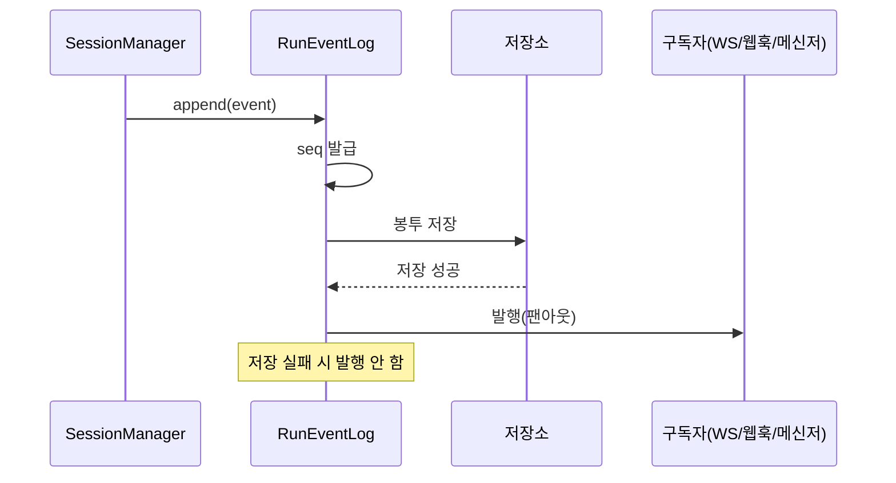

# 구성요소 상세개발계획서 — 06. RunEventLog / 이벤트 버스

> 위치: `apps/server/src/core/eventlog` · 레이어: 코어 · 단계: P0(PoC) → P1
> 관련 문서: 05(SessionManager) · 07(상태머신) · 02(API/WS) · 15(프론트엔드)
> 본 문서는 코드를 포함하지 않는다. 본 구성요소는 시스템의 키스톤이다.

## 1. 개요 및 책임
모든 실행(run) 이벤트를 **순번(seq)과 함께 먼저 저장한 뒤 발행**하는 이벤트 버스 겸 로그다. 저장이 발행에 선행하므로, 클라이언트 재접속 시 누락 구간을 리플레이할 수 있고, 인박스·알림·모니터링·감사가 모두 이 로그에서 파생된다. WebSocket은 이 버스의 구독자 중 하나일 뿐이며, 웹훅·메신저 싱크도 동일하게 구독한다.

## 2. 범위
- 포함: 이벤트 저장(순번 부여), 발행(팬아웃), 구독 관리, 특정 순번 이후 조회(리플레이), 보존 정책.
- 제외: 상태 전이 판정(07), 알림 대상 결정(09), 프로토콜 전송(02/10).

## 3. 의존성
- 상위 호출자: SessionManager(이벤트 기록), API 레이어/어댑터(구독·조회).
- 하위 피호출자: 데이터 모델(RunEvent 저장).
- 공유: `packages/shared`(도메인 이벤트·이벤트 봉투 형식).

## 4. 내부 구성 요소
| 구성 요소 | 역할 |
|---|---|
| 순번 발급기 | 실행별로 1부터 단조 증가하는 seq 부여 |
| 저장기 | 이벤트 봉투를 영속 저장(발행 이전) |
| 발행기(팬아웃) | 저장 성공 후 활성 구독자에게 전달 |
| 구독 관리기 | scope별 구독 등록/해제 |
| 조회기 | scope + lastSeq 초과 이벤트 조회(리플레이) |
| 보존 관리기 | 오래된 이벤트 아카이브/삭제 |

## 5. 데이터 구조 및 필드

### 5.1 이벤트 봉투(저장 단위)
| 필드 | 자료형 | 필수 | 의미 |
|---|---|---|---|
| globalOffset | 정수(서버 전역 1부터) | 필수 | **서버 전역 단조 증가 커서**(run 무관). project/global 리플레이 기준 |
| runId | 문자열 | 필수 | 실행 식별자 |
| seq | 정수(1부터) | 필수 | 실행 내 단조 증가 순번. session/run 리플레이 기준 |
| at | 시각(ISO8601) | 필수 | 발생 시각 |
| event | 도메인 이벤트 | 필수 | 실제 이벤트 |
| projectId | 문자열 | 필수 | scope 조회용 |
| sessionId | 문자열 | 필수 | scope 조회용 |

> **리플레이 커서 이원화(중요)**: `seq`는 실행별로 1부터 초기화되므로 단일 run/session 구독의 리플레이 기준으로만 사용한다. 여러 run을 가로지르는 **project/global 구독**은 서버 전역에서 단조 증가하는 `globalOffset`을 커서로 사용한다. 클라이언트는 구독 scope에 따라 둘 중 맞는 커서를 추적한다.

### 5.2 구독 항목
| 필드 | 자료형 | 의미 |
|---|---|---|
| subscriberId | 문자열 | 구독자 식별 |
| scope | session/project/global | 구독 범위 |
| scopeId | 문자열(선택) | 대상 식별자 |
| deliver | 전달 콜백 | 이벤트를 받을 대상 함수(싱크) |

## 6. 기능(동작) 명세

### 6.1 이벤트 기록(append)
- 목적: 실행 이벤트를 순번과 함께 저장하고 발행.
- 입력: runId, projectId, sessionId, 도메인 이벤트.
- 처리 절차:
  1. 해당 runId의 다음 `seq`를 발급하고, 서버 전역 `globalOffset`도 발급한다(둘 다 원자적 증가, 동시성 안전).
  2. 이벤트 봉투를 구성하여 **먼저 영속 저장**한다.
  3. 저장 성공 후에만 활성 구독자에게 발행한다.
  4. 저장 실패 시 발행하지 않고 오류를 반환한다.
- 사후조건: 저장된 이벤트는 조회로 재현 가능하다.
- 순서 보장: 동일 runId 내 `seq`는 빈틈없이 연속(1,2,3…)이어야 하고, `globalOffset`도 서버 전역에서 빈틈없이 단조 증가해야 한다.

### 6.2 특정 순번 이후 조회(리플레이)
- 목적: 재접속 클라이언트에게 누락 구간 제공.
- 입력: scope, scopeId, 커서값(cursor).
- 처리 절차:
  1. scope가 run/session이면 `seq`를, project/global이면 `globalOffset`을 커서로 사용한다.
  2. scope에 해당하는 이벤트 중 커서가 요청값 초과인 것을 커서 오름차순으로 조회한다.
  3. 순서대로 반환한다.
- 규칙: project/global scope는 `globalOffset` 단조성으로 정렬·리플레이하므로 여러 run이 섞여도 누락/중복이 없다. run/session scope는 `seq` 단조성을 그대로 이용한다. 두 경우 모두 정렬을 위한 별도 시각 기반 안정 정렬이 필요 없다.

### 6.3 구독/해제
- 구독: subscriberId·scope·전달 콜백을 등록한다.
- 해제: 연결 종료 시 구독을 제거한다.
- 발행 대상: 이벤트의 projectId/sessionId가 구독 scope와 일치하는 구독자에게만 전달.

### 6.4 보존 관리
- 규칙: 종료된 실행의 이벤트는 설정된 보존 기간 이후 아카이브 또는 삭제한다. 인박스 표시에 필요한 요약은 별도 보존한다.

## 7. 처리 흐름

## 8. 상호작용
- SessionManager가 유일한 기록자다.
- **상태머신은 RunEventLog를 단일 원천으로 소비하여 상태 전이를 유도한다.** 즉 상태 전이는 append된 이벤트를 소비하는 경로에서만 발생하며, SessionManager가 상태머신을 직접 호출해 이중으로 전이시키지 않는다(중복 전이 방지). 상태머신은 append 훅(저장 직후 동기 소비) 또는 전용 구독으로 이벤트를 받는다.
- API의 WebSocket 게이트웨이와 알림 엔진이 대표 구독자다.

## 9. 예외/에러 처리
- 저장 실패: 상위에 오류 반환, 발행 금지(정합성 우선).
- 발행 중 개별 구독자 실패: 해당 구독자만 로깅·격리하고 다른 구독자 전달은 계속한다.
- seq 충돌(동시 append): 원자적 증가로 방지, 위반 감지 시 재시도.

## 10. 보안 고려사항
- 조회/구독 시 scope 접근 권한은 호출측(API)에서 확인한다.
- 이벤트 payload에 비밀값이 포함되지 않도록 변환 단계(04)에서 마스킹한다.

## 11. 구성/설정값
- 보존 기간, 조회 페이지 크기, 발행 재시도 횟수, 백프레셔(느린 구독자) 정책을 설정으로 둔다.

## 12. 테스트 전략
- 저장-발행 순서 보장(저장 실패 시 미발행) 확인.
- 리플레이 정합성: lastSeq 경계(0, 중간, 최신, 미래값)에서 중복/누락 0.
- 동시 append 시 seq 연속성.
- 느린 구독자 격리(백프레셔) 동작.

## 13. 개발 순서 / 완료 기준(DoD)
- P0: 인메모리 저장+리플레이 PoC.
- P1: 영속 저장·구독·조회 확정. DoD: 재접속 리플레이가 중복/누락 없이 동작, 다중 구독자 팬아웃 정상.

## 14. 오픈 이슈
- 저장소 선택(관계형 테이블 vs 로그 특화 저장소).
- 초고빈도 텍스트 청크의 배치 저장/압축 전략.
