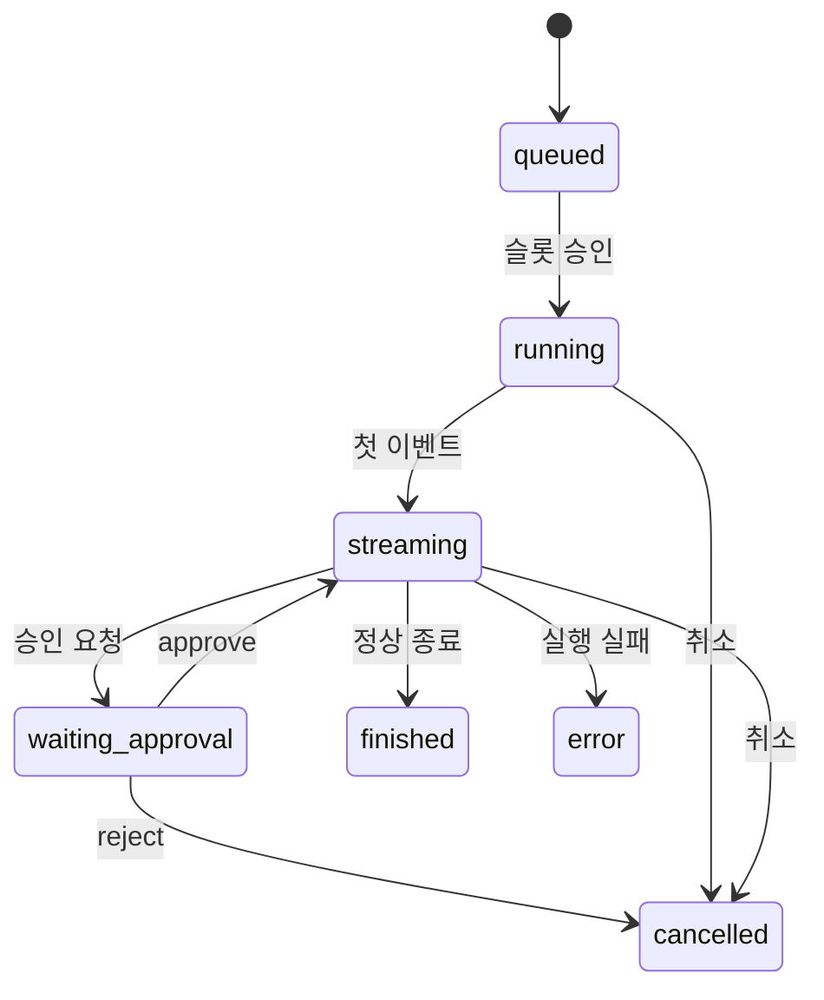

# 구성요소 상세개발계획서 — 07. 상태머신

> 위치: `apps/server/src/core/state` · 레이어: 코어 · 단계: P1
> 관련 문서: 06(이벤트로그) · 05(SessionManager) · 08(스케줄러) · 09(알림)
> 본 문서는 코드를 포함하지 않는다.

## 1. 개요 및 책임
프로젝트·세션·실행(run)의 **상태 전이를 단일 지점에서 관장**한다. **RunEventLog(06)에 기록된 도메인 이벤트를 단일 원천으로 소비하여** 전이를 수행하고(다른 구성요소가 상태머신을 직접 호출해 중복 전이시키지 않는다), 유효한 전이만 허용하며, 전이 결과를 데이터 모델에 반영하고, 파생 소비자(인박스·알림·승인 큐·스케줄러)가 참조할 상태를 제공한다. 상태 정의가 명확해야 "실행 중 목록", "완료 알림", "승인 대기 큐"가 자동으로 만들어진다.

> 승인 용어 구분: 본 문서의 `waiting_approval`/승인은 **실행 중 승인(AI 툴 실행에 대한 승인, 예: 위험 명령)** 을 의미한다. 커밋 전 변경 diff를 파일별로 검토하는 **변경 리뷰 승인**(12/15)과는 별개 개념이다.

## 2. 범위
- 포함: 상태 정의, 전이 규칙(허용/금지), 전이 트리거 처리, 상태 영속화, 파생 트리거 발생.
- 제외: 실제 알림 전송(09), 슬롯 관리(08), 이벤트 저장(06).

## 3. 의존성
- 상위 호출자: SessionManager(실행 전이 통지), RunEventLog(이벤트 소비), 승인 처리(승인 해소).
- 하위 피호출자: 데이터 모델(상태 필드 갱신), 알림 엔진(전이 통지), 스케줄러(슬롯 해제 신호).
- 공유: `packages/shared`(상태 열거값·이벤트 형식).

## 4. 내부 구성 요소
| 구성 요소 | 역할 |
|---|---|
| 전이 규칙표 | 각 엔티티의 현재 상태→다음 상태 허용 집합 정의 |
| 전이 실행기 | 이벤트를 받아 규칙 검증 후 상태 갱신 |
| 파생 트리거기 | 전이 시 인박스/알림/스케줄러에 신호 전달 |
| 상태 조회기 | 현재 상태 및 파생 뷰(실행 중 목록 등) 제공 |

## 5. 상태 정의 및 전이 규칙

### 5.1 실행(Run) 상태 전이표
| 현재 | 이벤트/조건 | 다음 | 비고 |
|---|---|---|---|
| (없음) | 실행 요청 접수 | queued | 스케줄러 대기 |
| queued | 슬롯 승인 | running | |
| running | 첫 스트림 이벤트 | streaming | 관찰 시작 |
| streaming | 승인 요청 발생 | waiting_approval | 실행 일시 대기 |
| waiting_approval | 승인 처리(approve) | streaming | 재개 |
| waiting_approval | 승인 처리(reject) | cancelled | 종료 |
| running/streaming | 종료 대기 결과 finished | finished | 정상 종료 |
| running/streaming | 종료 대기 결과 error | error | 실행 실패 |
| queued/running/streaming/waiting_approval | 취소 요청 | cancelled | |

### 5.2 세션(Session) 상태 전이표
| 현재 | 조건 | 다음 |
|---|---|---|
| idle | 소속 실행이 running/streaming | running |
| running | 소속 실행이 waiting_approval | waiting_approval |
| running/waiting_approval | 소속 실행 종료(정상/취소) | idle |
| running/streaming | 소속 실행 error | error |
| error | 새 실행 개시 | running |

### 5.3 프로젝트(Project) 상태 전이표
| 현재 | 조건 | 다음 |
|---|---|---|
| active | 아카이브 요청 | archived |
| archived | 복원 요청 | active |
| active/archived | 삭제 요청 | deleted |

## 6. 기능(동작) 명세

### 6.1 전이 실행
- 목적: 이벤트를 받아 유효 전이만 반영.
- 처리 절차:
  1. 대상 엔티티의 현재 상태를 조회한다.
  2. 전이 규칙표에서 (현재 상태, 이벤트)에 대한 다음 상태를 찾는다.
  3. 규칙에 없으면 전이를 거부하고 로깅한다(불변식 위반 방지).
  4. 허용되면 데이터 모델의 상태 필드를 갱신한다.
  5. 파생 트리거기를 통해 인박스/알림/스케줄러에 신호를 보낸다.
- 사후조건: 상태 필드가 유효 상태로 갱신되고 파생 신호가 발생한다.

### 6.2 파생 뷰 제공
- "실행 중 목록": run 상태가 running/streaming/waiting_approval인 항목.
- "승인 대기": run 상태가 waiting_approval인 항목.
- "복귀 카드용 상태": 세션의 최근 상태·요약.

### 6.3 파생 트리거 규칙
| 전이 | 파생 신호 |
|---|---|
| run→finished/error/cancelled | 스케줄러 슬롯 해제 + 알림 트리거 |
| run→waiting_approval | 승인 큐 등록 + 알림 트리거 |
| run→error | 에러 알림(우선순위 상향) |

## 7. 처리 흐름

## 8. 상호작용
- RunEventLog: **유일한 전이 입력원**. run_started/approval_required/run_done 등 기록된 이벤트를 소비해 전이한다(append 훅 또는 전용 구독).
- SessionManager: 이벤트를 기록할 뿐 상태머신을 직접 호출하지 않는다(중복 전이 방지).
- 스케줄러: 종료 전이 시 슬롯 해제 신호 수신. (queued→running 전이는 스케줄러의 슬롯 승인과 동기화.)
- 알림 엔진: 전이 시 알림 트리거 수신.

## 9. 예외/에러 처리
- 금지된 전이 요청: 거부 + 경고 로깅. 상태는 불변 유지.
- 동시 전이 경합: 엔티티 단위 직렬화(락 또는 큐)로 정합성 보장.

## 10. 보안 고려사항
- 상태 변경 트리거는 코어 내부에서만 호출(외부 직접 조작 불가).
- 프로젝트 삭제 전이는 되돌릴 수 없으므로 상위에서 인가·확인 후 호출.

## 11. 구성/설정값
- 전이 규칙표는 설정/상수로 명시하여 검토 가능하게 둔다.

## 12. 테스트 전략
- 전이표 전수 테스트: 허용 전이 성공, 금지 전이 거부.
- 동시 전이 경합 시 최종 상태 일관성.
- 파생 신호가 정확한 전이에서만 발생하는지.

## 13. 개발 순서 / 완료 기준(DoD)
- P1 착수(RunEventLog·SessionManager와 함께). DoD: 실행 전 생애주기 전이 정확, 파생 신호 정상.

## 14. 오픈 이슈
- 세션 다중 실행 시 세션 상태 합성 규칙(하나라도 running이면 running 등)의 세부.
- (서버 재시작 시 비종료 실행 정리는 05의 6.6 "안전 마감" 기본 정책을 따른다. 상태머신은 그때 기록되는 run_done(error)을 소비해 정리한다.)
