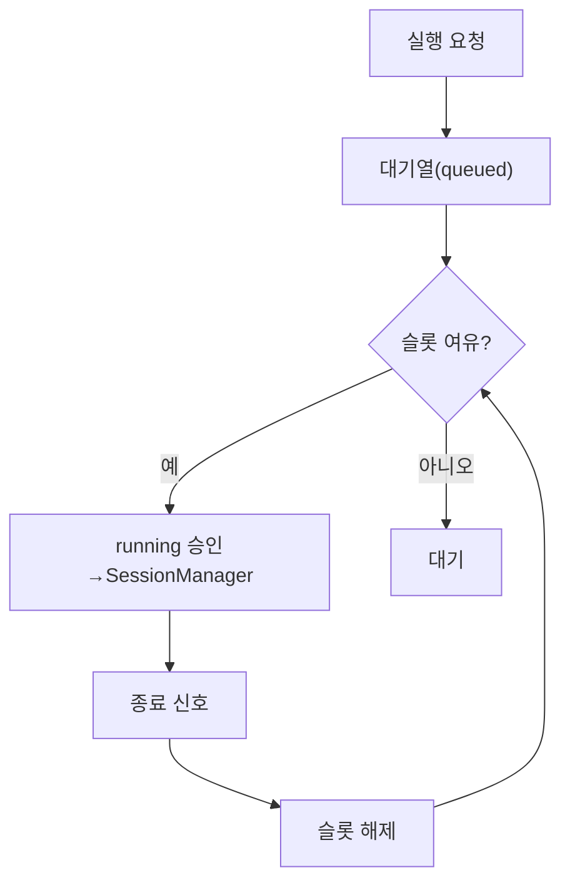

# 구성요소 상세개발계획서 — 08. 스케줄러 (동시성·큐)

> 위치: `apps/server/src/core/scheduler` · 레이어: 코어 · 단계: P1(기본) → P4(본격)
> 관련 문서: 17(Command 처리기) · 05(SessionManager) · 07(상태머신)
> 본 문서는 코드를 포함하지 않는다.

## 1. 개요 및 책임
서버(VPS/온프렘)는 유한 자원이므로, 동시에 실행되는 실행(run) 수를 제한하고 초과분을 **큐잉**한다. 실행 슬롯을 배분·회수하고, 우선순위에 따라 대기열에서 다음 실행을 승인한다. 여러 프로젝트가 동시에 실행을 요청해도 자원이 고갈되지 않도록 게이트 역할을 한다.

## 2. 범위
- 포함: 동시 실행 상한 관리, 대기열, 우선순위, 슬롯 승인/해제, 재시도 대기 반영.
- 제외: 실제 실행(05), 상태 전이(07), 알림(09).

## 3. 의존성
- 상위 호출자: Command 처리기(실행 요청 enqueue).
- 하위 피호출자: SessionManager(승인 시 실행 개시), 상태머신(queued/running 전이).
- 공유: `packages/shared`(상태값).

## 4. 내부 구성 요소
| 구성 요소 | 역할 |
|---|---|
| 슬롯 카운터 | 현재 실행 수와 상한 관리 |
| 대기열 | 승인 대기 실행 요청 보관(우선순위 정렬) |
| 승인기 | 슬롯 여유 시 대기열에서 다음 요청 승인 |
| 해제 수신기 | 실행 종료 신호를 받아 슬롯 반환 |
| 재시도 관리기 | 재시도 대기 시간(backoff) 이후 재큐잉 |

## 5. 데이터 구조 및 필드

### 5.1 실행 요청 항목(큐 요소)
| 필드 | 자료형 | 필수 | 의미 |
|---|---|---|---|
| runId | 문자열 | 필수 | 실행 식별자 |
| sessionId | 문자열 | 필수 | 소속 세션 |
| projectId | 문자열 | 필수 | 소속 프로젝트 |
| priority | 정수 | 필수 | 낮을수록 먼저(또는 정의된 순위) |
| enqueuedAt | 시각 | 필수 | 대기 시작 시각 |
| notBefore | 시각 | 선택 | 재시도 대기 반영 시각 |

### 5.2 슬롯 상태
| 필드 | 자료형 | 의미 |
|---|---|---|
| maxConcurrent | 정수 | 전체 동시 실행 상한 |
| running | 정수 | 현재 실행 수 |
| perProjectMax | 정수 | 프로젝트당 동시 실행 상한(선택) |

## 6. 기능(동작) 명세

### 6.1 실행 요청 접수(enqueue)
- 목적: 실행 요청을 받아 즉시 승인 또는 대기.
- 사전조건: Command 처리기(17)의 사용량 게이트를 이미 통과했다(중복 판정·인가 포함).
- 처리 절차:
  1. 실행을 queued 상태로 등록한다(상태머신).
  2. 우선순위와 함께 대기열에 넣는다.
  3. 승인기를 호출해 즉시 승인 가능하면 승인한다.
- 출력: 즉시 승인 여부(클라이언트에 202/실행 시작 통지).

### 6.1.1 사용량/예산 상한 게이트(연계)
- 사용량 상한(예산·쿼터) 1차 판정은 Command 처리기(17)에서 수행한다.
- 스케줄러는 장시간 대기 중 상한이 초과되는 경계 사례에 대비해, **승인 직전 최종 재확인**을 선택적으로 수행한다(설정). 초과 시 승인하지 않고 차단·알림한다.
- 이로써 남용·비용 폭주를 방지한다.

### 6.2 승인(승인기)
- 목적: 슬롯 여유 시 다음 실행 개시.
- 처리 절차:
  1. running이 maxConcurrent 미만인지 확인한다.
  2. perProjectMax가 설정된 경우 해당 프로젝트 실행 수도 확인한다.
  3. 대기열에서 notBefore 조건을 만족하는 최우선 요청을 꺼낸다.
  4. running을 1 증가시키고 상태를 running으로 전이한다.
  5. SessionManager에 실행 개시를 요청한다.
- 규칙: 슬롯이 없으면 대기 유지.

### 6.3 슬롯 해제
- 목적: 실행 종료 시 자원 반환.
- 처리 절차:
  1. 종료 신호(finished/error/cancelled)를 받는다.
  2. running을 1 감소시킨다.
  3. 승인기를 다시 호출해 대기열을 진행시킨다.

### 6.4 재시도 관리
- 목적: 재시도 가능한 실패의 안전한 재실행.
- 처리 절차:
  1. 재시도 가능 실패는 재시도 대기 시간(backoff, 또는 서버 제공 재시도 지연)을 notBefore로 설정해 재큐잉한다.
  2. 최대 재시도 횟수를 초과하면 error로 확정한다.
- 규칙: 맹목적 재시도로 중복 실행이 발생하지 않도록 requestId 멱등성을 이용한다.

## 7. 처리 흐름

## 8. 상호작용
- Command 처리기: 프롬프트 실행을 enqueue로 위임.
- SessionManager: 승인 시 실행 개시, 종료 시 해제 신호 전달.
- 상태머신: queued↔running 전이 동기화.

## 9. 예외/에러 처리
- 승인 후 개시 실패: 즉시 슬롯 해제 후 재시도 관리로 이관.
- 대기열 과다: 대기열 상한 초과 시 신규 요청 429 거부.
- 고아 슬롯(해제 신호 유실): 주기적 정합성 점검으로 running 수 보정.

## 10. 보안 고려사항
- 자원 소진(DoS) 방지: 사용자/프로젝트별 대기열 상한 적용.
- 우선순위 조작 방지: priority는 서버가 결정(사용자 임의 지정 제한).

## 11. 구성/설정값
- maxConcurrent(서버 자원 기준), perProjectMax, 대기열 상한, 최대 재시도 횟수, backoff 기본값.

## 12. 테스트 전략
- 동시 요청 N개 시 running이 상한을 초과하지 않는지.
- 종료 시 대기열이 정확히 진행되는지.
- 재시도 backoff·최대 횟수 준수.
- 고아 슬롯 보정 동작.
- 부하 테스트: 다수 프로젝트 동시 실행에서 자원 안정성.

## 13. 개발 순서 / 완료 기준(DoD)
- P1: 전역 동시 상한 + 단순 FIFO 큐. DoD: 상한 준수, 종료 시 진행.
- P4: 우선순위·프로젝트별 상한·재시도 정교화.

## 14. 오픈 이슈
- 우선순위 기준(현재 보고 있는 세션 우대 등)의 구체 정책.
- 다중 서버 확장 시 분산 대기열 필요 여부(초기엔 단일 서버 가정).
