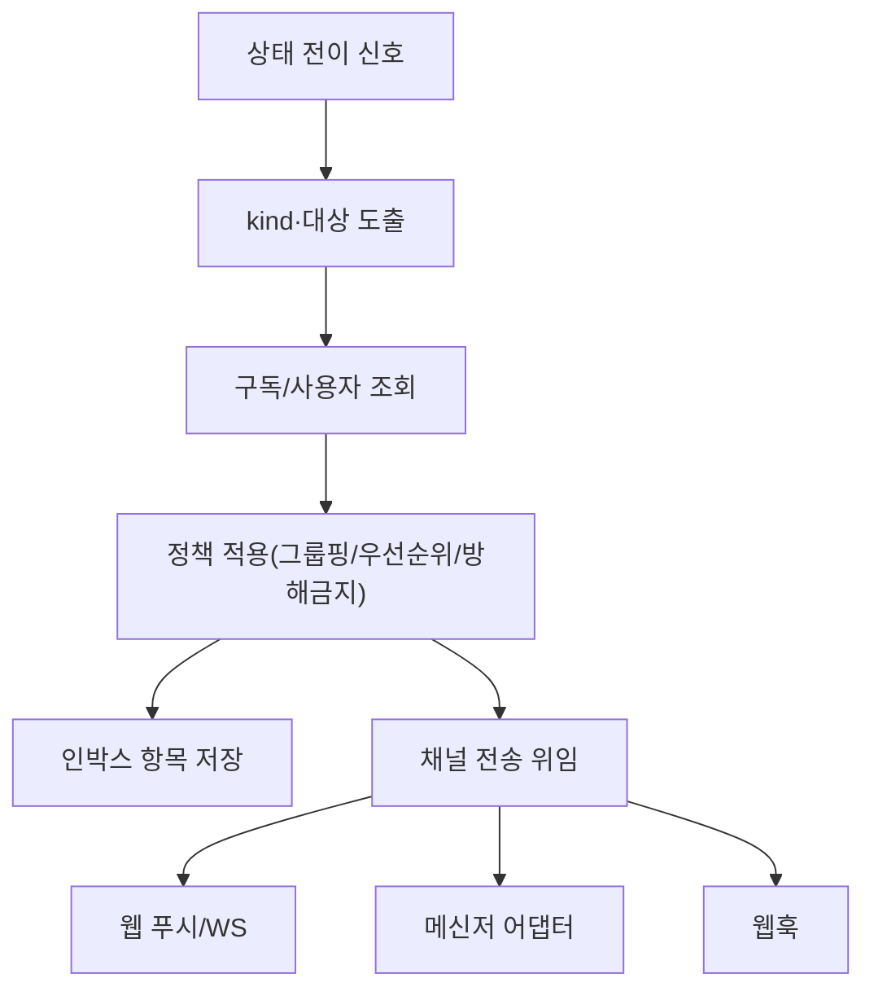

# 구성요소 상세개발계획서 — 09. 알림 정책 엔진

> 위치: `apps/server/src/core/notification` · 레이어: 코어 · 단계: P4
> 관련 문서: 07(상태머신) · 10(채널 어댑터) · 02(API/구독) · 12(변경 리뷰)
> 본 문서는 코드를 포함하지 않는다.

## 1. 개요 및 책임
상태머신의 전이 신호를 받아 **어떤 사용자에게 · 어떤 채널로 · 무엇을 알릴지** 결정하고, 알림 항목을 생성하여 전역 인박스에 적재하며, 외부 싱크(웹 푸시·메신저·웹훅)로 전달을 트리거한다. "컴퓨터를 못 쓰는" 사용자에게 완료·승인·에러를 적시에 도달시키는 것이 핵심 목적이다. 실제 채널 전송 자체는 어댑터가 담당하고, 본 엔진은 정책과 인박스 적재를 담당한다.

## 2. 범위
- 포함: 알림 트리거 수신, 알림 대상·채널 결정, 그룹핑·우선순위·방해금지 적용, 인박스 항목 생성, 딥링크 구성, 전송 위임.
- 제외: 전이 판정(07), 실제 채널 전송(10/02), 구독 저장(02).

## 3. 의존성
- 상위 호출자: 상태머신(전이 트리거).
- 하위 피호출자: 데이터 모델(Notification/Subscription), 채널 어댑터·WebSocket(전송 위임).
- 공유: `packages/shared`.

## 4. 내부 구성 요소
| 구성 요소 | 역할 |
|---|---|
| 트리거 수신기 | 전이 신호를 알림 후보로 변환 |
| 대상 결정기 | 소유 사용자·구독을 조회하여 수신 대상 산출 |
| 정책 적용기 | 그룹핑·우선순위·방해금지·채널 on/off 적용 |
| 인박스 적재기 | Notification 항목 생성·저장 |
| 전송 디스패처 | 채널별 싱크로 전달 위임 |

## 5. 데이터 구조 및 필드

### 5.1 알림 항목(Notification)
| 필드 | 자료형 | 필수 | 의미 |
|---|---|---|---|
| id | 문자열 | 필수 | 알림 식별자 |
| userId | 문자열 | 필수 | 수신 사용자 |
| projectId | 문자열 | 선택 | 관련 프로젝트 |
| sessionId | 문자열 | 선택 | 관련 세션 |
| kind | 문자열 | 필수 | run_done/approval_required/error 등 |
| priority | 정수 | 필수 | 표시·전송 우선순위 |
| read | 참/거짓 | 필수 | 열람 여부 |
| deeplink | 문자열 | 필수 | 관련 화면으로 이동하는 경로 |
| createdAt | 시각 | 필수 | 생성 시각 |

### 5.2 알림 종류·기본 우선순위
| kind | 트리거 | 기본 우선순위 |
|---|---|---|
| error | run→error | 최상 |
| approval_required | run→waiting_approval (**실행 중 승인**: AI 툴 실행 승인) | 상 |
| review_ready | 변경 diff 준비됨 (**변경 리뷰 승인** 대기, 12/15) | 상 |
| quota_exceeded | 사용량 상한 초과 | 상 |
| exec_timeout | exec 시간 상한 초과 (13 §9, ExecService) | 중상 |
| exec_memory_limit | exec 메모리 상한 초과 (13 §9, docker) | 중상 |
| run_done | run→finished | 중 |
| info | 기타 | 하 |

> `exec_timeout`·`exec_memory_limit`은 상태머신 전이가 아니라 ExecService 자원 상한 초과 시 직접 트리거한다. dedup은 userId+projectId+kind, 5분 창.

> 용어 구분: `approval_required`는 실행 도중 AI 툴에 대한 승인이고, `review_ready`는 커밋 전 변경 diff의 파일별 리뷰 승인을 위한 알림이다. 둘은 별개 흐름이다.

## 6. 기능(동작) 명세

### 6.1 알림 생성
- 목적: 전이 신호를 인박스 항목 + 전송으로 변환.
- 처리 절차:
  1. 전이 신호에서 kind·관련 엔티티를 도출한다.
  2. 대상 결정기로 수신 사용자와 구독(채널)을 조회한다.
  3. 정책 적용기로 방해금지·채널 on/off·그룹핑·우선순위를 적용한다.
  4. 인박스 항목(Notification)을 생성·저장한다(딥링크 포함).
  5. 활성 채널별로 전송 디스패처에 전달을 위임한다.
- 사후조건: 인박스에 항목이 남고, 허용된 채널로 전송이 트리거된다.

### 6.2 그룹핑 규칙
- 동일 프로젝트/세션에서 짧은 시간에 발생한 동종 알림은 하나로 묶어 소음을 줄인다.
- 그룹 대표 항목에 발생 건수를 표기한다.

### 6.3 방해금지(조용시간)
- 사용자 설정 시간대에는 최상 우선순위(error)를 제외한 푸시 전송을 보류하고, 인박스에는 계속 적재한다.

### 6.4 인박스 조회 지원
- 미열람 우선, 우선순위·시각 정렬로 목록을 제공한다(조회 API는 02).

## 7. 처리 흐름

## 8. 상호작용
- 상태머신: 트리거 공급자.
- 채널 어댑터/WebSocket: 실제 전송 실행자.
- 데이터 모델: 인박스·구독·사용자 설정 저장.

## 9. 예외/에러 처리
- 특정 채널 전송 실패: 해당 채널만 재시도/로깅, 인박스 항목은 유지.
- 대상 없음(구독 없음): 인박스에만 적재.

## 10. 보안 고려사항
- 알림 내용에 코드/비밀값 원문을 담지 않고 요약·딥링크만 담는다.
- 딥링크 접근 시 수신자 권한을 재확인한다(권한 없는 대상 노출 방지).

## 11. 구성/설정값
- 채널별 on/off 기본값, 방해금지 시간대, 그룹핑 시간창, 우선순위 매핑, 전송 재시도 정책.

## 12. 테스트 전략
- kind별 우선순위·채널 라우팅 정확성.
- 방해금지 중 error만 전송, 나머지 보류 확인.
- 그룹핑 시간창 내 묶음 처리.
- 채널 실패 격리(인박스 유지).

## 13. 개발 순서 / 완료 기준(DoD)
- P4 착수. DoD: 완료/승인/에러가 인박스 적재 + 최소 1개 채널(웹 푸시) 전송, 방해금지·그룹핑 동작.
- **구현 (P7 mobile 3차):** `PushService.sendExpoToUser` — Expo Push API로 mobile 네이티브 알림. Web Push(VAPID)와 병행.

## 14. 오픈 이슈
- 사용자별 세밀한 알림 규칙 UI 범위.
- 다국어 알림 문구 관리.
