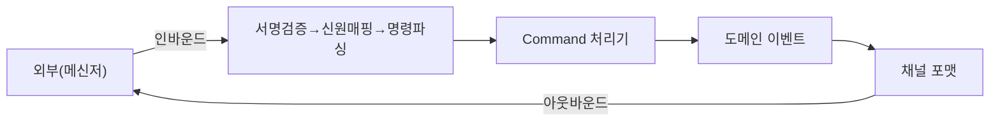

# 구성요소 상세개발계획서 — 10. 채널 어댑터 (통합 레이어)

> 위치: `apps/server/src/adapters` · 레이어: 어댑터 · 단계: P4(첫 메신저) → P7(확장/MCP)
> 관련 문서: 02(API/웹훅) · 03(인증) · 17(Command 처리기) · 09(알림)
> 본 문서는 코드를 포함하지 않는다.

## 1. 개요 및 책임
외부 애플리케이션(메신저·봇·CI·AI 비서)과 서버를 연결하는 **번역 계층**이다. 포트&어댑터 패턴으로, 채널별 어댑터가 (1)외부 인바운드 payload를 정규 명령으로 번역하고 (2)정규 도메인 이벤트를 채널 메시지 형식으로 번역·전송한다. 코어는 어댑터의 존재를 모르며, 새 채널 추가는 어댑터 추가만으로 이뤄진다(코어 불변).

## 2. 범위
- 포함: 채널별 인바운드 파서, 아웃바운드 포매터/전송기, 서명 검증, 명령 문법(ChatOps)/자연어 처리 연계, 푸시형·풀형 연결 방식.
- 제외: 인가 판단(03), 알림 정책(09), 명령 실행(코어), 이벤트 저장(06).

## 3. 의존성
- 상위 호출자: API 웹훅 엔드포인트(인바운드), 알림 엔진/RunEventLog(아웃바운드).
- 하위 피호출자: 인증(채널 신원 해석), Command 처리기, 시크릿 매니저(채널 토큰).
- 공유: `packages/shared`(명령/이벤트 형식).

## 4. 내부 구성 요소
| 구성 요소 | 역할 |
|---|---|
| 어댑터 레지스트리 | 채널 식별자→어댑터 매핑 |
| 공통 어댑터 계약 | 모든 어댑터가 제공해야 하는 동작 정의 |
| 인바운드 파서 | 외부 payload→정규 명령 |
| 아웃바운드 포매터 | 도메인 이벤트→채널 메시지 |
| 서명 검증기 | 채널 요청 진위 확인 |
| 연결 방식 관리 | 푸시(웹훅 수신)/풀(폴링·소켓) 방식 선택 |

## 5. 데이터 구조 및 필드

### 5.1 공통 어댑터가 제공해야 하는 동작(계약, 서술)
| 동작 | 입력 | 출력 | 설명 |
|---|---|---|---|
| 인바운드 파싱 | 외부 원본 payload | 정규 명령 또는 없음 | 명령이 아니면 없음 반환 |
| 아웃바운드 전달 | 도메인 이벤트, 전달 대상 | 없음(전송 수행) | 채널 형식으로 변환·전송 |
| 서명 검증 | 원본 요청/헤더 | 참/거짓 | 진위 확인 |
| 연결 방식 | — | push/pull | 채널의 인바운드 수신 방식 |

### 5.2 전달 대상(ChannelTarget)
| 필드 | 자료형 | 의미 |
|---|---|---|
| channel | ChannelSource | 대상 채널 |
| externalUserId 또는 방/스레드 식별자 | 문자열 | 전송 목적지 |

### 5.3 명령 문법(ChatOps) 매핑 표(예: 접두어 기반)
| 문법(개념) | 정규 명령 |
|---|---|
| 새 프로젝트 생성 명령 | create_project |
| 세션에 프롬프트 전송 | send_prompt |
| 상태 조회 | status |
| 승인/거절 | approve |
| 실행 취소 | cancel |
| 터미널 명령 실행 | exec_command (terminal:exec) |

## 6. 기능(동작) 명세

### 6.1 인바운드 처리
- 목적: 외부에서 온 요청을 명령으로 변환하여 코어에 전달.
- 처리 절차:
  1. 채널 식별자로 어댑터를 선택한다.
  2. 서명 검증을 수행한다(실패 시 거부).
  3. 외부 사용자 식별자를 인증의 채널 신원 해석기로 매핑한다(미링크 시 링크 안내).
  4. payload를 정규 명령으로 파싱한다. 명령 문법 또는 자연어(채널 AI가 의도 추출)로 해석한다.
  5. 인가 판단 후 Command 처리기에 전달한다.
- 오류: 검증 실패/미링크/파싱 실패 시 사용자에게 안내 메시지.

### 6.2 아웃바운드 처리
- 목적: 도메인 이벤트를 채널 메시지로 전달.
- 처리 절차:
  1. 알림 엔진 또는 RunEventLog 구독으로 이벤트를 수신한다.
  2. 채널 형식으로 요약·포맷한다(코드/비밀값 미포함).
  3. 전달 대상으로 전송한다.
- 규칙: 이벤트 원문이 아니라 사람이 읽을 요약 위주로 전달한다.

### 6.3 연결 방식 선택(인트라넷 대응)
- push 방식: 외부→서버 웹훅 수신이 가능한 환경.
- pull 방식: 폐쇄망 등으로 인바운드 수신이 불가하면 서버가 채널 API를 폴링하거나 소켓 방식으로 이벤트를 수신한다.
- 어댑터는 두 방식 중 채널·배포 환경에 맞는 것을 제공한다.

### 6.4 MCP 노출(확장)
- 서버 기능(프로젝트 생성·프롬프트 전송·상태 조회)을 MCP 도구로 노출하여, MCP 지원 AI/메신저가 표준 프로토콜로 서버를 조종하게 한다. 어댑터별 개별 구현 부담을 줄인다.
- **구현 (P7):** `@modelcontextprotocol/sdk` Streamable HTTP stateless — `POST /api/v1/mcp` (Bearer 인증). Tools: `create_project`, `send_prompt`, `get_status`, `approve_run`, `cancel_run`, `exec_command` → `CommandHandler`. production `MCP_ENABLED=true` opt-in, dev 기본 ON (`ops/mcp-mode.md`).

## 7. 처리 흐름

## 8. 상호작용
- 인증: 채널 신원 해석·인가.
- Command 처리기: 명령 실행 진입점.
- 알림 엔진/RunEventLog: 아웃바운드 이벤트 공급.
- 시크릿 매니저: 채널 토큰 보관.

## 9. 예외/에러 처리
- 서명 검증 실패: 요청 거부·로깅.
- 명령 해석 실패: 사용법 안내 반환.
- 전송 실패: 재시도·로깅, 상위 알림 엔진에 실패 통지.

## 10. 보안 고려사항
- 채널 토큰은 시크릿 매니저에만 저장, 온프렘에서 외부 유출 방지.
- 위험 명령의 채널별 제한(인가와 연계).
- 아웃바운드 메시지에 코드·비밀값 원문 미포함.
- 웹훅 서명·타임스탬프·재생 공격 방지.

## 11. 구성/설정값
- 채널별 자격(토큰), 연결 방식(push/pull), 명령 접두어, 폴링 주기(풀 방식), 메시지 길이 제한.

## 12. 테스트 전략
- 인바운드: 서명 검증, 미링크 사용자, 명령 문법·자연어 파싱 정확성.
- 아웃바운드: 이벤트→요약 변환, 전송 실패 재시도.
- push/pull 양 방식 동작.
- 코드/비밀값 누출 없음 확인.

## 13. 개발 순서 / 완료 기준(DoD)
- P4: 첫 메신저 어댑터(예: 텔레그램 또는 슬랙) + 웹훅 인바운드 + 아웃바운드 요약. DoD: 메신저에서 명령→진행 요약 수신 왕복.
- P7: 사내 메신저 어댑터, MCP 노출, 자연어 해석 강화.
  - **1차 슬라이스:** Telegram **pull** — `TELEGRAM_PULL_MODE=true` …
  - **2차 보강:** update_id 멱등·update별 offset·backoff·push 배타·`/dev project`·**intranet pull** (`INTRANET_MESSENGER_POLL_URL`) · `ops/telegram-pull-mode.md`
  - **3차 (S31 IT):** `runIntranetPullTick` + `intranet-pull.integration.test.ts` (telegram pull IT 동등)
  - **4차:** `channel-request-id` UUID v5, S31 send_prompt real-path IT (mock 없음)
  - **5차 (UR-16 2차):** run_done → `INTRANET_MESSENGER_NOTIFY_URL` outbound (`intranet-s31-outbound.integration.test.ts`)

## 14. 오픈 이슈
- 첫 대상 메신저 선정.
- 자연어 해석을 서버측 파서로 할지 채널 AI에 위임할지.
