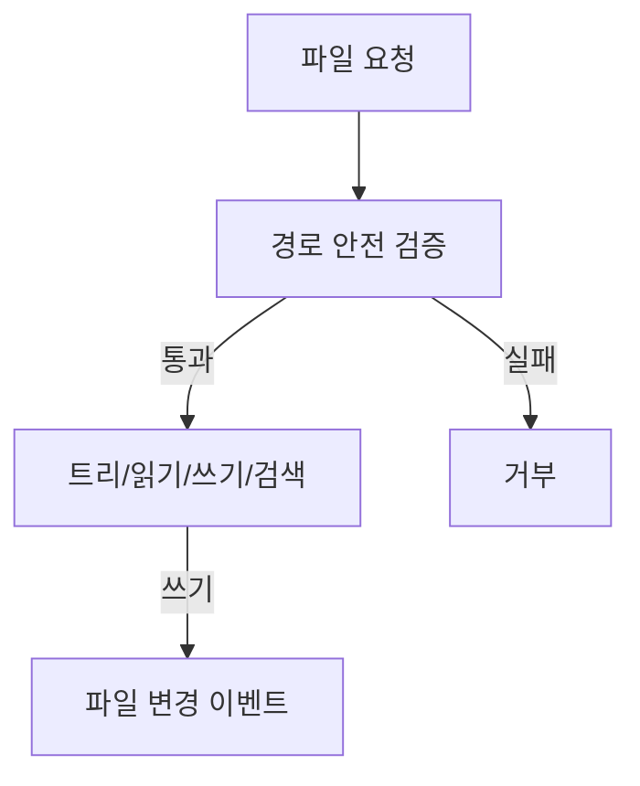

# 구성요소 상세개발계획서 — 11. 파일 서비스

> 위치: `apps/server/src/services/file` · 레이어: 코어 · 단계: P3
> 관련 문서: 02(API) · 12(Git) · 13(터미널/샌드박스)
> 본 문서는 코드를 포함하지 않는다.

## 1. 개요 및 책임
프로젝트 워크스페이스의 **파일 트리 조회·파일 읽기·파일 저장·검색**을 담당한다. 확장자에 따른 언어 종류를 추론해 클라이언트 뷰어가 올바른 렌더러를 선택하도록 돕는다. 경로 탈출 공격을 방어하여 프로젝트 루트 밖 접근을 차단한다.

## 2. 범위
- 포함: 트리 조회, 파일 내용 조회(언어 추론), 파일 저장, 파일 조작(생성/이름변경/이동/삭제), 프로젝트 내 검색, 경로 안전 검증, **첨부(이미지/파일) blob 저장·조회**.
- 제외: git 작업(12), 실행/미리보기(13), AI 편집(SDK가 파일을 직접 수정하며 서비스는 이후 변경 감지·제공).

## 3. 의존성
- 상위 호출자: API 레이어, Command 처리기.
- 하위 피호출자: 파일 시스템(워크스페이스 디렉터리), 데이터 모델(프로젝트 rootPath).
- 공유: `packages/shared`.

## 4. 내부 구성 요소
| 구성 요소 | 역할 |
|---|---|
| 경로 안전기 | 요청 경로를 절대경로로 해석하고 루트 내부 여부 검증 |
| 트리 생성기 | 디렉터리를 재귀 순회하여 트리 구조 생성 |
| 파일 읽기기 | 내용 읽기 + 언어 추론 + 바이너리 판별 |
| 파일 쓰기기 | 내용 저장(원자적 쓰기) |
| 파일 조작기 | 생성/이름변경/이동/삭제 |
| 검색기 | 파일명·텍스트 검색 |
| 언어 추론기 | 확장자→언어 종류 매핑 |

## 5. 데이터 구조 및 필드

### 5.1 트리 노드
| 필드 | 자료형 | 필수 | 의미 |
|---|---|---|---|
| name | 문자열 | 필수 | 파일/폴더 이름 |
| path | 문자열 | 필수 | 프로젝트 상대 경로 |
| type | dir / file | 필수 | 종류 |
| children | 트리 노드 배열 | dir일 때 | 하위 항목 |
| size | 정수 | file일 때 | 바이트 크기 |

### 5.2 파일 내용 응답
| 필드 | 자료형 | 의미 |
|---|---|---|
| path | 문자열 | 상대 경로 |
| language | 문자열 | 추론된 언어 종류 |
| encoding | 문자열 | 텍스트 인코딩 또는 binary |
| content | 문자열 | 텍스트 내용(바이너리는 미포함) |
| truncated | 참/거짓 | 대용량으로 잘렸는지 |

### 5.3 언어 추론 매핑(대표)
| 확장자 그룹 | 언어 종류 |
|---|---|
| .ts .tsx .js .jsx | 자바스크립트/타입스크립트 |
| .py | 파이썬 |
| .md .markdown | 마크다운 |
| .csv .tsv | 표 데이터 |
| .json | JSON |
| .png .jpg .svg 등 | 이미지 |
| 기타/판별불가 | 바이너리 |

## 6. 기능(동작) 명세

### 6.1 경로 안전 검증(모든 파일 동작의 선행)
- 목적: 루트 밖 접근 차단.
- 처리 절차:
  1. 프로젝트 rootPath를 기준으로 요청 경로를 절대경로로 해석한다.
  2. 해석된 경로가 rootPath를 접두어로 포함하는지 확인한다.
  3. 포함하지 않으면 거부한다(`..` 등 탈출 차단).
- 규칙: 심볼릭 링크로 인한 우회도 실제 경로 기준으로 재확인한다.

### 6.2 트리 조회
- 처리 절차:
  1. 경로 안전 검증 후 디렉터리를 재귀 순회한다.
  2. 제외 목록(예: .git, node_modules 등 대용량/불필요)은 건너뛰거나 접힌 상태로 표시한다.
  3. 트리 노드 구조로 반환한다.

### 6.3 파일 읽기
- 처리 절차:
  1. 경로 안전 검증.
  2. 크기가 상한을 초과하면 잘라 읽고 truncated 표시.
  3. 바이너리 판별 후 텍스트면 인코딩 추정, 바이너리면 내용 미포함(미리보기 불가 표시).
  4. 확장자로 언어 종류를 추론한다.

### 6.4 파일 저장
- 처리 절차:
  1. 경로 안전 검증 + 쓰기 권한 인가.
  2. 임시 파일에 쓴 뒤 원자적 교체로 저장한다(부분 쓰기 방지).
  3. 파일 변경 사실을 이벤트로 알려 트리/뷰어 갱신을 유도한다.

### 6.5 파일 조작
- 생성/이름변경/이동/삭제 각각 경로 안전 검증 + 인가 후 수행. 삭제는 되돌릴 수 없으므로 확인 절차 권장.

### 6.6 검색
- 파일명 검색과 내용(텍스트) 검색을 제공한다. 대용량/바이너리는 내용 검색에서 제외한다. 결과는 경로·라인·매치 스니펫으로 반환한다.

### 6.7 첨부(blob) 저장·조회
- 목적: 프롬프트 첨부(이미지/파일, 01의 Attachment)의 실제 바이트 저장·서빙.
- 처리 절차:
  1. 업로드 시 프로젝트 스코프의 첨부 저장 공간(워크스페이스 내 전용 디렉터리 또는 별도 blob 저장소)에 저장하고 참조 키(ref)를 발급한다.
  2. Attachment.ref로 조회·다운로드를 제공한다.
  3. `file_ref` 종류(프로젝트 파일 참조)는 저장 없이 기존 파일 경로를 가리킨다.
- 규칙: 크기·MIME 제한을 적용하고, 경로 안전 검증을 동일하게 적용한다. 참조 키는 추측 불가하게 발급한다.
- **구현 (UR-15 2차):** `prompt-attachments.ts` — image blob → base64 → SdkAdapter `SDKUserMessage.images`.
- **구현 (UR-15 3차):** `serializeAttachmentsJson` → Message.attachmentsJson 영구 저장.
- **구현 (UR-15 4차):** `.attachments/{ref}.mime` sidecar, GET `Content-Type`/`Content-Disposition`.
- **구현 (UR-15 5차):** `@fastify/multipart` — `POST /projects/:id/attachments` multipart field `file` + JSON `{ dataBase64, mime }` dual.
- **구현 (UR-15 6차):** orphan 첨부 GC(maintenance)·Web FormData 업로드.

## 7. 처리 흐름

## 8. 상호작용
- API: 트리/파일/검색 엔드포인트의 실행 주체.
- SDK(04): AI가 파일을 직접 수정하면, 변경 감지 또는 file_change 이벤트와 연계해 최신 상태를 제공.
- Git(12): 저장·조작 후 상태 반영.

## 9. 예외/에러 처리
- 경로 탈출/권한 없음: 거부.
- 미존재 파일: 404.
- 대용량: truncated로 안전 처리.
- 저장 충돌(동시 편집): 마지막 저장 기준 또는 버전 충돌 경고(정책 선택).

## 10. 보안 고려사항
- 경로 탈출 방어를 모든 동작의 전제 조건으로 강제한다.
- 프로젝트 경계를 넘는 접근·시스템 파일 접근 차단.
- 쓰기/삭제는 인가 필수.

## 11. 구성/설정값
- 파일 읽기 최대 크기, 트리 제외 목록, 검색 대상 최대 크기, 텍스트 인코딩 기본값.

## 12. 테스트 전략
- 경로 탈출(`..`, 절대경로, 심볼릭 링크) 차단.
- 대용량 파일 truncated 처리.
- 바이너리 판별.
- 원자적 저장(중단 시 원본 보존).
- 검색 정확성·바이너리 제외.

## 13. 개발 순서 / 완료 기준(DoD)
- P3 착수. DoD: 트리·읽기(언어추론)·저장·경로방어 동작, 검색 제공.

## 14. 오픈 이슈
- 동시 편집 충돌 정책(마지막 우선 vs 버전 검사).
- 대용량 저장소 트리의 지연 로딩(폴더 단위 lazy).
