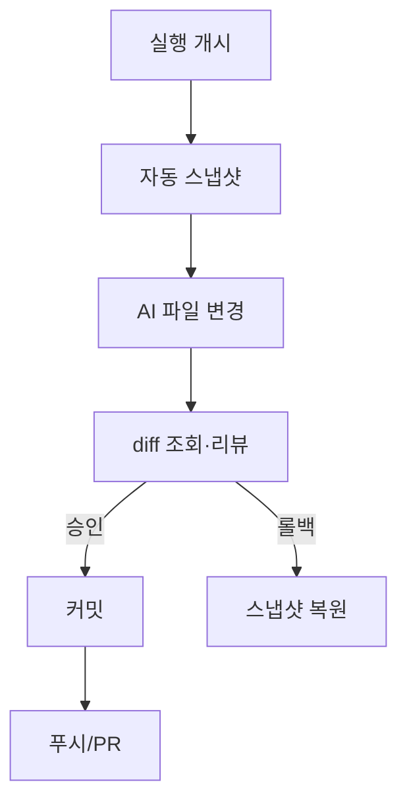

# 구성요소 상세개발계획서 — 12. Git 서비스

> 위치: `apps/server/src/services/git` · 레이어: 코어 · 단계: P5
> 관련 문서: 05(SessionManager) · 11(파일) · 07(상태머신) · 15(프론트엔드)
> 본 문서는 코드를 포함하지 않는다.

## 1. 개요 및 책임
프로젝트의 버전 관리를 담당한다. 프로젝트 생성 시 저장소를 초기화하거나 원격을 clone하고, **실행 전 자동 스냅샷(체크포인트)**, 변경 diff 제공, 스테이징·커밋·브랜치·푸시·PR을 수행한다. 이를 통해 결과물이 서버에 갇히지 않고 회수·롤백 가능하게 한다.

## 2. 범위
- 포함: 저장소 초기화/clone, 상태·diff 조회, 스테이징/커밋, 브랜치 생성/전환, 원격 푸시, PR 생성, 자동 스냅샷/롤백.
- 제외: 파일 내용 읽기/쓰기(11), AI 실행(05), 자격 저장(시크릿 매니저).

## 3. 의존성
- 상위 호출자: API 레이어, Command 처리기, SessionManager(실행 전 스냅샷 훅).
- 하위 피호출자: git 실행 환경, 시크릿 매니저(원격 인증 토큰), 데이터 모델(세션↔브랜치 매핑).
- 공유: `packages/shared`.

## 4. 내부 구성 요소
| 구성 요소 | 역할 |
|---|---|
| 저장소 초기화기 | init 또는 clone |
| 상태/diff 조회기 | 변경 목록·diff 생성 |
| 커밋기 | 스테이징 + 커밋 |
| 브랜치 관리기 | 생성/전환/세션 매핑 |
| 원격 연동기 | push/PR + 인증 |
| 스냅샷 관리기 | 실행 전 체크포인트·롤백 |

## 5. 데이터 구조 및 필드

### 5.1 변경 항목
| 필드 | 자료형 | 의미 |
|---|---|---|
| path | 문자열 | 파일 경로 |
| changeKind | added/modified/deleted/renamed | 변경 종류 |
| staged | 참/거짓 | 스테이징 여부 |

### 5.2 diff 데이터
| 필드 | 자료형 | 의미 |
|---|---|---|
| path | 문자열 | 대상 파일 |
| hunks | 변경 구획 목록 | 라인 단위 추가/삭제 |

### 5.3 세션↔브랜치 매핑
| 필드 | 자료형 | 의미 |
|---|---|---|
| sessionId | 문자열 | 세션 |
| branch | 문자열 | 대응 브랜치 |

## 6. 기능(동작) 명세

### 6.1 저장소 준비
- 빈 프로젝트: 저장소를 초기화하고 초기 커밋을 만든다.
- git-import: 원격 URL로 clone한다(인증 토큰 사용, 실패 시 안내).

### 6.2 자동 스냅샷(체크포인트)
- 목적: AI 실행 전 안전망.
- 처리 절차:
  1. 실행 개시 직전(SessionManager 훅) 현재 작업 트리를 스냅샷 커밋 또는 태그로 기록한다.
  2. 스냅샷 식별자를 실행 메타에 저장한다.
- 롤백: 사용자가 특정 스냅샷으로 되돌리기를 요청하면 해당 지점으로 복원한다.

### 6.3 상태·diff 조회 (변경 리뷰 승인)
- 변경 파일 목록과 파일별 diff(hunk)를 제공한다. **변경 리뷰 승인** 화면(파일별 승인/거절 후 커밋)에 사용된다.
- 용어 구분: 이는 커밋 전 사후 리뷰 승인이며, 실행 도중 AI 툴에 대한 **실행 중 승인**(07의 `waiting_approval`)과는 별개다.

### 6.4 커밋
- 처리 절차: 지정 파일을 스테이징하고 메시지로 커밋한다. 저자/시각 메타를 기록한다.

### 6.5 브랜치·세션 매핑
- 세션 생성 시 대응 브랜치를 만들 수 있다(기능개발/버그픽스 병렬을 브랜치로 분리). 매핑을 저장한다.

### 6.6 원격 푸시·PR
- 처리 절차: 인증 토큰으로 원격에 push한다. 필요 시 PR(제목/본문)을 생성한다. 결과(URL 등)를 반환한다.

## 7. 처리 흐름

## 8. 상호작용
- SessionManager: 실행 전 스냅샷 훅.
- 파일 서비스(11): 변경된 파일 상태 공유.
- API: 커밋/푸시/PR/디프 엔드포인트 실행.
- 시크릿 매니저: 원격 인증 자격.

## 9. 예외/에러 처리
- clone/push 인증 실패: 자격 재설정 안내.
- 충돌: 충돌 파일 목록·상태 반환, 해소 방법 안내.
- 스냅샷 실패: 실행을 차단할지 경고 후 진행할지는 정책으로 결정(기본: 경고 후 진행 불가 옵션 제공).

## 10. 보안 고려사항
- 원격 자격 토큰은 시크릿 매니저에만 저장.
- 커밋 저자 정보에 민감정보 미포함.
- 푸시 대상 원격 화이트리스트(온프렘 정책).

## 11. 구성/설정값
- 기본 브랜치명, 스냅샷 방식(커밋/태그), 자동 스냅샷 on/off, 원격 화이트리스트, 커밋 저자 기본값.

## 12. 테스트 전략
- init/clone 경로.
- 스냅샷 생성·롤백 정확성.
- diff 정확성(추가/삭제/이름변경).
- 커밋/푸시/PR 인증·실패 처리.
- 충돌 상황 보고.

## 13. 개발 순서 / 완료 기준(DoD)
- P5 착수. DoD: 스냅샷·diff·커밋·푸시 동작, 세션↔브랜치 매핑, 롤백 가능.

## 14. 오픈 이슈
- 충돌 자동 해소(AI 활용) 범위.
- PR 대상 호스팅(깃허브/기타) 다양성 대응.
