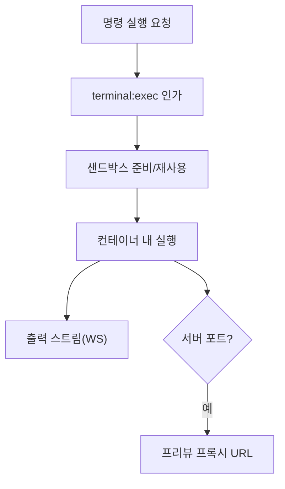

# 구성요소 상세개발계획서 — 13. 터미널/프리뷰 (샌드박스)

> 위치: `apps/server/src/services/exec` · 레이어: 코어 · 단계: P6
> 관련 문서: 04(SdkAdapter 실행 격리) · 11(파일/워크스페이스) · 16(운영 보안)
> 본 문서는 코드를 포함하지 않는다.

## 1. 개요 및 책임
프로젝트 안에서 **명령 실행(빌드/테스트/실행)** 과 그 출력 스트리밍, 그리고 실행 중인 웹 앱을 볼 수 있는 **라이브 프리뷰(포트 포워딩)** 를 제공한다. 모든 실행은 반드시 **샌드박스(컨테이너 격리)** 안에서 이루어져야 하며, 프로젝트별로 격리된다. 검증 루프(코드가 실제로 동작하는지)를 완성하는 구성요소다.

## 2. 범위
- 포함: 샌드박스 세션 관리, 명령 실행·출력 스트리밍, 입력 전달(대화형), 프로세스 수명/종료, 포트 프리뷰 프록시, 자원 상한.
- 제외: 파일 편집(11), git(12), AI 실행(05).

## 3. 의존성
- 상위 호출자: API 레이어(터미널 WS/프리뷰), Command 처리기.
- 하위 피호출자: 컨테이너 런타임, 워크스페이스 마운트, RunEventLog(선택: 툴 출력 연계).
- 공유: `packages/shared`.

## 4. 내부 구성 요소
| 구성 요소 | 역할 |
|---|---|
| 샌드박스 관리기 | 프로젝트별 격리 컨테이너 생성/재사용/파기 |
| 명령 실행기 | 컨테이너 내 명령 실행·출력 스트림 |
| 입출력 브리지 | 터미널 입력↔출력 스트림 중계 |
| 프리뷰 프록시 | 컨테이너 내부 포트를 외부 접근 URL로 프록시 |
| 자원 감시기 | CPU/메모리/시간/포트 상한 적용 |

## 5. 데이터 구조 및 필드

### 5.1 샌드박스 세션
| 필드 | 자료형 | 의미 |
|---|---|---|
| sandboxId | 문자열 | 샌드박스 식별자 |
| projectId | 문자열 | 대상 프로젝트 |
| status | 문자열 | 생성/실행/종료 |
| resourceLimits | 객체 | CPU/메모리/시간 상한 |

### 5.2 명령 실행 항목
| 필드 | 자료형 | 의미 |
|---|---|---|
| execId | 문자열 | 실행 식별자 |
| command | 문자열 | 실행 명령 |
| cwd | 문자열 | 컨테이너 내 작업 경로 |
| exitCode | 정수(선택) | 종료 코드 |

### 5.3 프리뷰 매핑
| 필드 | 자료형 | 의미 |
|---|---|---|
| internalPort | 정수 | 컨테이너 내부 포트 |
| previewUrl | 문자열 | 외부 접근 URL(임시·인증) |

## 6. 기능(동작) 명세

### 6.1 샌드박스 준비
- 처리 절차:
  1. 프로젝트별 격리 컨테이너를 생성(또는 재사용)한다.
  2. 프로젝트 워크스페이스를 컨테이너에 마운트한다.
  3. 자원 상한(CPU/메모리/시간)을 적용한다.
- 규칙: 프로젝트 간 파일·네트워크·프로세스가 서로 침범할 수 없어야 한다.

### 6.2 명령 실행·출력 스트림
- 처리 절차:
  1. 인가(terminal:exec 스코프)를 확인한다.
  2. 컨테이너 내에서 명령을 실행한다.
  3. 표준출력/표준오류를 실시간 스트림으로 전송한다(WebSocket).
  4. 종료 코드를 전달한다.
- 대화형: 사용자 입력을 프로세스 표준입력으로 중계한다.

### 6.3 라이브 프리뷰
- 처리 절차:
  1. 컨테이너 내부 포트를 인증된 임시 URL로 프록시한다.
  2. 접근 시 사용자 권한을 확인한다.
  3. 세션 종료/유휴 시 프록시를 해제한다.

### 6.4 수명 관리
- 유휴 시간 초과·프로젝트 종료·서버 종료 시 샌드박스를 파기하여 자원을 회수한다.

## 7. 처리 흐름

## 8. 상호작용
- API: 터미널 WebSocket·프리뷰 URL 발급.
- 인증: 실행/프리뷰 접근 인가.
- 파일 서비스: 동일 워크스페이스 공유(마운트).
- **SDK 에이전트 실행 격리 공유(중요)**: 본 구성요소의 프로젝트별 격리 컨테이너는 **AI 에이전트(04)의 실행 환경으로도 재사용**하는 것을 목표로 한다. 즉 사용자 터미널과 에이전트 툴 실행이 동일한 프로젝트 샌드박스·자원 상한·이그레스 정책을 공유하여, "사용자 터미널만 격리되고 에이전트는 호스트에서 실행되는" 비대칭을 제거한다.

### 8.1 AI 툴 출력 vs 사용자 터미널 경계
- **AI가 SDK 툴로 실행한 명령**(예: 테스트/빌드)의 출력은 실행 스트림을 통해 도메인 이벤트(tool)로 RunEventLog(06)에 기록되어 작업 현황에 표시된다.
- **사용자가 직접 연 터미널**의 출력은 본 구성요소가 터미널 WebSocket으로 직접 스트리밍한다(RunEventLog 경유 아님).
- 둘은 별개 경로이며, 동일 프로젝트 샌드박스·워크스페이스를 공유하되 출력 전달 채널이 다르다.

## 9. 예외/에러 처리
- 자원 상한 초과: 프로세스 강제 종료·알림(`exec_timeout`, `exec_memory_limit` — 09).
- 무한 실행/행: 시간 상한으로 종료.
- 샌드박스 생성 실패: 실행 거부·안내.

## 10. 보안 고려사항 (최우선)
- 모든 실행은 격리 샌드박스 내부에서만. 호스트 직접 실행 금지.
- 네트워크 이그레스 제한(필요 시 화이트리스트).
- 프리뷰 URL은 인증·만료·추측 불가 토큰.
- 프로젝트 간 완전 격리.
- 위험 명령은 terminal:exec 스코프 보유자만.

## 11. 구성/설정값
- 컨테이너 이미지/런타임, CPU/메모리/시간 상한, 유휴 파기 시간, 네트워크 정책, 프리뷰 포트 범위·토큰 수명.

## 12. 테스트 전략
- 격리 검증: 한 프로젝트에서 다른 프로젝트/호스트 접근 불가.
- 자원 상한 초과 시 종료.
- 출력 스트림 실시간성·종료 코드 정확성.
- 프리뷰 URL 인증·만료.

## 13. 개발 순서 / 완료 기준(DoD)
- P6 착수. DoD: 샌드박스 명령 실행·출력 스트림, 프리뷰 URL, 자원 상한·격리 확인.

## 14. 오픈 이슈
- 컨테이너 런타임 선택 및 온프렘 정책.
- 장시간 실행 서비스(데몬형)의 수명·비용 관리.
