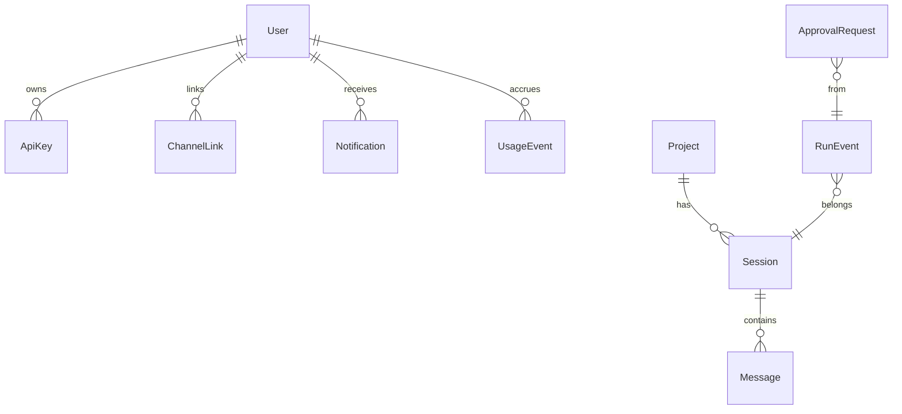

# 구성요소 상세개발계획서 — 14. 데이터 모델 / DB

> 위치: `apps/server/src/db` · 레이어: 인프라 · 단계: P1(핵심 테이블·seam) → 단계별 확장
> 관련 문서: 01(상태·스코프 값 정합) · 06(RunEvent) · 03(인증) · 09(알림/구독)
> 본 문서는 코드/스키마 코드를 포함하지 않으며, 테이블·필드·관계를 표로 정의한다.

## 1. 개요 및 책임
전체 시스템의 영속 데이터 스키마를 정의한다. 프로젝트/세션/메시지, 이벤트 로그, 승인/알림/구독, 사용량, 인증(사용자/키/채널링크), 시크릿을 저장한다. P1에서 멀티프로젝트·통합을 위한 "이음새" 필드(예: source/channel, projectId 귀속)를 미리 포함하여 이후 소급 마이그레이션 비용을 없앤다.

## 2. 범위
- 포함: 테이블 정의, 필드·자료형·제약, 관계, 인덱스, 마이그레이션 원칙, 보존 정책.
- 제외: 비즈니스 로직, 쿼리 구현.

## 3. 의존성
- 상위 호출자: 모든 코어 구성요소·인증.
- 하위 피호출자: DB 엔진(운영 Postgres / 개발 SQLite), ORM.
- 공유: `packages/shared`(상태·스코프 열거값과 값 일치).

## 4. 테이블 정의

### 4.1 User (사용자)
| 필드 | 자료형 | 제약 | 의미 |
|---|---|---|---|
| id | 문자열 | PK | 사용자 식별자 |
| createdAt | 시각 | 기본=현재 | 생성 시각 |
| (인증 관련 필드) | — | — | 로그인 수단은 인증 문서와 연계 |

### 4.2 ApiKey (머신 자격)
| 필드 | 자료형 | 제약 | 의미 |
|---|---|---|---|
| id | 문자열 | PK | |
| userId | 문자열 | FK→User | 소유자 |
| hashedKey | 문자열 | 유니크 | 해시 저장(원문 미저장) |
| scopes | 문자열(스코프 목록) | — | 허용 권한 |
| expiresAt | 시각 | 선택 | 만료 |

### 4.3 ChannelLink (메신저 매핑)
| 필드 | 자료형 | 제약 | 의미 |
|---|---|---|---|
| id | 문자열 | PK | |
| userId | 문자열 | FK→User | 앱 사용자 |
| channel | 문자열 | — | 채널 종류 |
| externalUserId | 문자열 | (channel,externalUserId) 유니크 | 외부 사용자 |

### 4.4 Project (프로젝트)
| 필드 | 자료형 | 제약 | 의미 |
|---|---|---|---|
| id | 문자열 | PK | |
| name | 문자열 | — | 프로젝트명 |
| rootPath | 문자열 | — | 워크스페이스 경로 |
| status | 문자열 | 기본=active | active/archived/deleted |
| pinned | 참/거짓 | 기본=거짓 | 즐겨찾기 |
| lastActiveAt | 시각 | 선택 | 최근 활동(정렬용) |
| createdAt | 시각 | 기본=현재 | |

### 4.5 Session (세션)
| 필드 | 자료형 | 제약 | 의미 |
|---|---|---|---|
| id | 문자열 | PK | |
| projectId | 문자열 | FK→Project | 소속 |
| agentId | 문자열 | — | SDK 에이전트 식별자(재개용) |
| title | 문자열 | 선택 | 제목(자동 생성 가능) |
| summary | 문자열 | 선택 | 복귀용 요약 |
| branch | 문자열 | 선택 | git 브랜치 매핑 |
| model | 문자열 | — | 사용 모델 |
| status | 문자열 | 기본=idle | idle/running/waiting_approval/error |
| source | 문자열 | 기본=web | 생성 출처 채널(이음새) |
| createdAt | 시각 | 기본=현재 | |

### 4.6 Message (대화 메시지)
| 필드 | 자료형 | 제약 | 의미 |
|---|---|---|---|
| id | 문자열 | PK | |
| sessionId | 문자열 | FK→Session | 소속 |
| role | 문자열 | — | user/assistant/tool |
| content | 문자열 | — | 텍스트(툴콜은 구조화 텍스트) |
| attachmentsJson | 문자열 | 선택 | UR-15: send_prompt 첨부 ref 목록(JSON) |
| runId | 문자열 | 선택 | 관련 실행 |
| createdAt | 시각 | 기본=현재 | |

### 4.7 RunEvent (이벤트 로그·리플레이 원천)
| 필드 | 자료형 | 제약 | 의미 |
|---|---|---|---|
| id | 문자열 | PK | |
| globalOffset | 정수 | (globalOffset) 유니크 | 서버 전역 단조 커서 |
| runId | 문자열 | (runId,seq) 유니크 | 실행 |
| seq | 정수 | — | 실행 내 순번 |
| type | 문자열 | — | 이벤트 종류 |
| payload | JSON | — | 이벤트 상세 |
| projectId | 문자열 | 인덱스 | scope 조회 |
| sessionId | 문자열 | 인덱스 | scope 조회 |
| createdAt | 시각 | 인덱스 | 정렬 |

### 4.8 ApprovalRequest (승인 요청)
| 필드 | 자료형 | 제약 | 의미 |
|---|---|---|---|
| id | 문자열 | PK | |
| runId | 문자열 | 인덱스 | 관련 실행 |
| kind | 문자열 | — | 승인 종류 |
| payload | JSON | — | 승인 대상 상세 |
| resolved | 참/거짓 | 기본=거짓 | 처리 여부 |
| decision | 문자열 | 선택 | approve/reject |

### 4.9 Notification (알림/인박스)
| 필드 | 자료형 | 제약 | 의미 |
|---|---|---|---|
| id | 문자열 | PK | |
| userId | 문자열 | 인덱스 | 수신자 |
| projectId | 문자열 | 선택 | 관련 프로젝트 |
| sessionId | 문자열 | 선택 | 관련 세션 |
| kind | 문자열 | — | 알림 종류 |
| priority | 정수 | — | 우선순위 |
| read | 참/거짓 | 기본=거짓 | 열람 |
| deeplink | 문자열 | — | 이동 경로 |
| createdAt | 시각 | 인덱스 | |

### 4.10 Subscription (아웃바운드 구독)
| 필드 | 자료형 | 제약 | 의미 |
|---|---|---|---|
| id | 문자열 | PK | |
| channel | 문자열 | — | 대상 채널 |
| target | 문자열 | — | 전송 목적지 |
| filter | JSON | — | 이벤트 필터 |

### 4.11 UsageEvent (사용량)
| 필드 | 자료형 | 제약 | 의미 |
|---|---|---|---|
| id | 문자열 | PK | |
| userId | 문자열 | 인덱스 | 귀속 사용자 |
| projectId | 문자열 | 선택·인덱스 | 프로젝트별 집계 |
| kind | 문자열 | — | send 등 |
| createdAt | 시각 | 인덱스 | 기간 집계 |

### 4.12 Secret (시크릿 참조)
| 필드 | 자료형 | 제약 | 의미 |
|---|---|---|---|
| id | 문자열 | PK | |
| scope | 문자열 | — | 전역/프로젝트/채널 |
| key | 문자열 | — | 이름 |
| valueEnc | 문자열 | — | 암호화 저장값 |

## 5. 관계도

## 6. 인덱스·성능 규칙
- RunEvent: (runId, seq) 유니크, **globalOffset 유니크**, createdAt 인덱스(리플레이/정렬).
- Notification: (userId, read, createdAt) 복합 인덱스(인박스 조회).
- UsageEvent: (userId, createdAt), (projectId, createdAt) 인덱스(집계).
- Project: (status, lastActiveAt) 인덱스(목록·정렬).

## 7. 마이그레이션·보존 원칙
1. P1에서 이음새 필드(source/channel, projectId 귀속)를 포함해 이후 소급 변경을 피한다.
2. 스키마 변경은 마이그레이션 파일로 관리하고 되돌리기를 제공한다.
3. RunEvent는 보존 기간 후 아카이브/삭제(요약은 별도 보존).
4. Project=deleted는 소프트 삭제 후 유예 기간 뒤 물리 삭제(워크스페이스 포함).

## 8. 상호작용
- 모든 코어 구성요소가 이 스키마를 통해 상태를 영속화한다.
- 상태 열거값은 `packages/shared`와 문자열 값이 정확히 일치해야 한다.

## 9. 예외/에러 처리
- 유니크 제약 위반(예: RunEvent seq 충돌)은 재시도로 처리.
- 참조 무결성 위반 방지(FK), 삭제 시 연쇄 정책 명시.

## 10. 보안 고려사항
- 비밀값은 valueEnc로 암호화 저장, 원문 미저장.
- API 키 해시만 저장.
- 개인정보 최소 수집.

## 11. 구성/설정값
- 운영 DB(Postgres) / 개발 DB(SQLite) 접속 설정, 보존 기간, 연쇄 삭제 정책.

## 12. 테스트 전략
- 제약·인덱스 동작, 마이그레이션 up/down.
- 소프트 삭제·물리 삭제 유예.
- 대량 RunEvent에서 조회/집계 성능.

## 13. 개발 순서 / 완료 기준(DoD)
- P1: User/Project/Session/Message/RunEvent + 이음새 필드. 이후 단계에서 Approval/Notification/Subscription/Usage/Secret 확장.
- DoD: 핵심 테이블·관계·인덱스 정의, 마이그레이션 동작.

## 14. 오픈 이슈
- RunEvent 저장소 분리(로그 특화 저장소) 여부.
- 멀티유저 도입 시 소유권/공유 테이블 확장.
