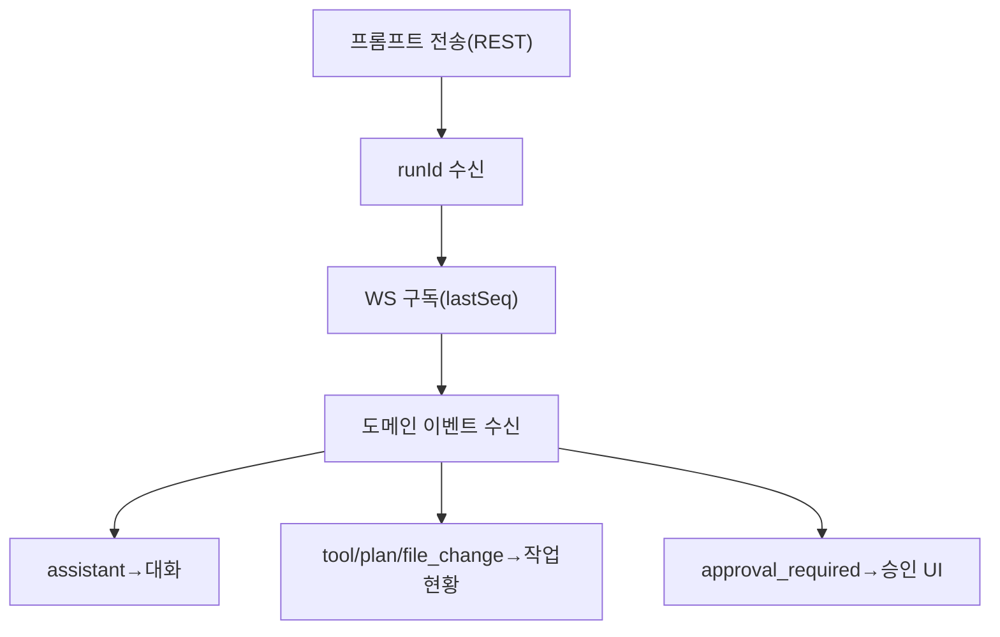

# 구성요소 상세개발계획서 — 15. 프론트엔드 (웹/모바일 PWA)

> 위치: `apps/web` · 레이어: 클라이언트 · 단계: P2(채팅) → P3(파일) → P4(멀티/인박스) → 이후 확장
> 관련 문서: 02(API/WS) · 06(리플레이 커서) · 09(알림/인박스) · 01(공유 타입)
> 본 문서는 코드를 포함하지 않는다.

## 1. 개요 및 책임
사용자가 접속하는 클라이언트로, **IDE에 준하는 경험**(파일 트리·뷰어·직접 편집·채팅·실시간 작업 관찰)과 멀티프로젝트 탐색·전역 인박스·사용량을 제공한다. 서버 자체 API만 사용하는 특권 없는 클라이언트이며, PWA로 제공하여 모바일 홈 화면 설치·오프라인 캐시를 지원한다.

## 2. 범위
- 포함: 화면 구성(정보구조), 파일 뷰어(확장자별 렌더), 채팅·스트리밍 표시, 재접속 리플레이 처리, 인박스·알림, 사용량, 음성/이미지 입력(확장), PWA.
- 제외: 서버 로직, 인증 발급(서버), 실제 실행(서버).

## 3. 의존성
- 상위: 사용자.
- 하위 피호출자: 서버 API(REST/WebSocket), 웹 푸시.
- 공유: `packages/shared`(명령/이벤트/상태 타입 재사용).

## 4. 내부 구성 요소(화면·모듈)
| 구성 요소 | 역할 |
|---|---|
| 프로젝트 스위처/목록 | 프로젝트 탐색·핀·상태 필터 |
| 전역 인박스 | 완료/승인/에러를 프로젝트 무관 집계·딥링크 |
| 파일 트리 | 폴더 구조 표시·조작 |
| 파일 뷰어/에디터 | 확장자별 렌더 + 직접 편집·저장 |
| 채팅 패널 | 프롬프트 입력·대화·스트리밍 표시 |
| 작업 현황 패널 | 계획/툴콜/파일변경/승인요청 실시간 표시 |
| diff 리뷰 | 변경 diff·파일별 승인/거절 |
| 사용량 화면 | 자체 사용량 미터 |
| 연결 관리자 | WebSocket 연결·재접속·리플레이 처리 |

## 5. 정보 구조(화면 계층)
- 글로벌 레벨: 프로젝트 목록 / 전역 인박스 / 사용량·설정.
- 프로젝트 레벨: 파일 트리 · 세션(채팅) 목록 · 터미널 · git · diff 리뷰.
- 모바일: 하단 탭(프로젝트/인박스/사용량). 웹: 좌측 사이드바 + 3분할.

## 6. 기능(동작) 명세

### 6.1 파일 뷰어 렌더 규칙
| 파일 종류 | 렌더 방식 |
|---|---|
| 코드(ts/js/py 등) | 코드 에디터(문법 하이라이트) + 편집·저장 |
| 마크다운 | 렌더된 문서 보기(+원문 토글) |
| CSV/TSV | 표 형태 |
| JSON | 구조 강조 또는 접이식 트리 |
| 이미지 | 미리보기 |
| 바이너리 | 미리보기 불가 + 다운로드 |

### 6.2 채팅·스트리밍 표시
- 처리 절차:
  1. 프롬프트 전송은 REST로 보내고 runId를 받는다.
  2. WebSocket 구독으로 도메인 이벤트를 수신해 대화/작업현황에 반영한다.
  3. assistant는 텍스트 누적, tool/plan/file_change는 작업 현황에, approval_required(**실행 중 승인**: AI 툴 승인)는 승인 UI로 표시한다.

### 6.3 재접속·리플레이 처리
- 처리 절차:
  1. 구독 scope에 맞는 커서값을 로컬에 저장한다. run/session 구독은 실행별 `seq`, project/global 구독(인박스·전역 모니터링)은 서버 전역 `globalOffset`을 사용한다.
  2. 연결이 끊기면 자동 재연결하며 마지막 커서값을 함께 보낸다.
  3. 서버 리플레이를 수신해 누락분을 메우고 라이브로 전환한다.
- 규칙: 중복 이벤트는 커서값으로 제거한다. run/session과 project/global 커서를 혼동하지 않도록 구독 단위로 분리 저장한다.

### 6.4 전역 인박스
- 모든 프로젝트의 알림을 한 목록으로 표시하고, 항목 선택 시 딥링크로 해당 세션/diff로 이동한다. 미열람 우선·우선순위 정렬.

### 6.5 diff 리뷰 (변경 리뷰 승인)
- 변경 파일별 diff를 표시하고 파일 단위 승인/거절, 승인분 커밋 요청. 이는 커밋 전 사후 리뷰이며, 실행 중 AI 툴 승인(6.2의 approval_required)과 UI·흐름을 구분해 표시한다.

### 6.6 입력 확장(모바일다움)
- 음성 입력(음성→텍스트), 이미지 첨부(스크린샷)로 프롬프트를 보강한다.

### 6.7 PWA
- 홈 화면 설치, 오프라인 시 캐시된 파일·최근 대화 열람, 웹 푸시 알림 수신.

## 7. 처리 흐름(스트리밍 표시)

## 8. 상호작용
- 서버 API: 모든 데이터·명령·스트림의 원천.
- 웹 푸시: 완료/승인/에러 알림 수신.
- 공유 타입: 이벤트/명령 형식 재사용으로 계약 일치.

## 9. 예외/에러 처리
- 연결 끊김: 자동 재접속·리플레이·중복 제거.
- 명령 실패: 서버 표준 에러(재시도 가능 여부) 표시.
- 오프라인: 캐시 열람 모드로 전환, 쓰기 작업 비활성·대기.

## 10. 보안 고려사항
- 접근 토큰 안전 저장, 자동 갱신.
- 딥링크 접근 시 서버 권한 재확인에 의존.
- 민감정보 로컬 캐시 최소화.

## 11. 구성/설정값
- API/WS 기본 주소, 재접속 backoff, 캐시 정책, 파일 뷰어 최대 표시 크기, 알림 권한 요청 시점.

## 12. 테스트 전략
- 스트리밍 표시·재접속 리플레이(중복/누락 없음).
- 확장자별 뷰어 렌더.
- 인박스 딥링크 이동·권한.
- PWA 설치·오프라인·푸시.
- 모바일/데스크톱 반응형 레이아웃.

## 13. 개발 순서 / 완료 기준(DoD)
- P2: 채팅+스트림+재접속(PWA). DoD: 폰 브라우저에서 대화·스트리밍·재접속 정상.
- P3: 파일 트리·뷰어·편집.
- P4: 멀티프로젝트·인박스·푸시.
- **구현 (P7 UR-15 2차):** `resolvePromptWithAttachments` → SDK `SDKUserMessage.images` (04 §6.3). Web: preview unmount fix, steer 음성, `capture`, 10MB 검증.
- **구현 (P7 UR-15 3차):** `Message.attachmentsJson` + `fetchAttachmentBlob` → 채팅 reload 후 이미지 썸네일. S26 `speech-send-flow` 계약 테스트.
- **구현 (P7 UR-15 4차):** `userMessageContent`·`userMessageDisplayContent` 중복 제거, reload sync, 썸네일 확대·file 다운로드, `buildVoiceSendPayload`, blob 캐시.
- **구현 (P7 UR-15 5차):** Playwright S26 — mock SpeechRecognition → textarea → send_prompt UI E2E (`test:e2e:s26`). e2e session seed로 CURSOR_API_KEY 없이 세션 준비.
- **구현 (P7 UR-15 6차):** Web `FormData` multipart 업로드. Playwright S27 첨부 UI E2E (`test:e2e:s27`). S26 append·send 202 검증. `p7-e2e-helpers` 공유.
- **구현 (P7 UR-16 2차):** 채팅 «이전 메시지 더 보기» + **reload 시 older merge**. S19 summary 카드 Playwright. S28 pagination E2E.
- **구현 (P7 3차 — 네이티브 1차):** `apps/mobile` Expo — API 설정·프로젝트·세션(summary)·send_prompt REST. `ops/mobile-client.md`.
- **구현 (P7 mobile 2차):** WS 스트림·작업현황·approval/cancel·messages pagination·`X-Channel-Source: mobile`·expo-notifications 토큰 등록 stub.
- **구현 (P7 mobile 3차):** 서버 Expo Push API (`/push/expo-subscribe`)·NotificationEngine 연동·알림 deeplink 수신.
- **구현 (P7 mobile 4차):** 인박스(`GET /inbox`)·deeplink 네비게이션·푸시 탭 리스너·EAS projectId·등록 실패 UX.
- **구현 (P7 mobile 5차):** **steer**·**사용량 탭**·**변경 리뷰(diff)**·review_ready deeplink.
- **구현 (P7 mobile 6차):** diff **push/PR/rollback**·usage **프로젝트별**·Chat **quota 차단/배지**·steer **canSteerRun 가드**·quota_exceeded 인박스·file_change→diff shortcut.
- **구현 (P7 mobile 7차):** **터미널 WS + 프리뷰 URL**·**UR-15 이미지 첨부 + STT 음성**·프로젝트 탭(세션|터미널|diff)·terminal deeplink.
- **구현 (P7 mobile 8차):** 터미널 **WS 재연결**·출력 **auto-scroll**·프리뷰 **WebView in-app**·UR-15 **썸네일(`fetchAttachmentFileUri`)**·**카메라**·**10MB 검증**·전송 실패 **첨부 복구**·**steer 음성**·pending 첨부 제거 UI.
- **구현 (P7 mobile 9차):** **FilesScreen** (트리·읽기 전용 뷰어)·프로젝트 탭 **파일**·`@app/shared` **file-types**·서버 **Expo Push Receipt**·DiffScreen 포맷 정리.
- **구현 (P7 mobile 10차):** Files **검색·저장 MVP**·로드 **race fix**·트리 **web parity**·`file-api-paths`·Expo Receipt **retry**·Maestro files smoke.
- **구현 (P7 mobile 11차):** UR-02 **파일 CRUD**·**Markdown 미리보기**·트리 **FlatList 가상화**·Maestro files CRUD smoke.
- **구현 (P7 mobile 12차):** `@app/shared` **api-http**·**GitScreen** + `GET /git`·**ExpoReceiptPending** DB·Markdown **코드블록·링크**·Maestro **풀 시나리오**·ProjectNavBar **5탭**.
- **구현 (P7 mobile 13차):** web **api-http 공유**·**Maestro CI gate** (`test:maestro:ci`)·Markdown **테이블·이미지**·P7 gate **mobile full unit**.
- **구현 (P7 mobile 14차):** `@app/shared` **api-fetch**·web **api-keys 버그 fix**·**api-http invalid JSON**·Expo receipt **idempotency·로깅**·Git **staged/unstaged**·Markdown **blockquote·Image preview**·Maestro **settings-flow + gate 강화**.
- **구현 (P7 mobile 15차):** `@app/shared` **ClientApiError**·web/mobile **ApiError 통일**·ExpoReceiptPending **FK cascade + orphan prune**·Markdown **autolink·italic**·**git deeplink**·Maestro **device CI scaffold** (`p7-mobile-maestro-e2e.yml`).
- **구현 (P7 mobile 16차):** `@app/shared` **deeplink**·**git_status** 알림·Markdown **_italic_/www**·Maestro **`--app-path` + APK build workflow**·**orphan prune 스크립트**·web git inbox → diff.
- **구현 (P7 mobile 17차):** web **GitStatusPanel + git 탭**·inbox **git → git 패널**·Markdown **nested inline (recursive)**·Maestro **adb 검증 + emulator runner workflow**.
- **구현 (P7 mobile 18차):** `@app/shared` **ProjectGitStatus**·Markdown **nested bold fix (`**bold *inner* text**`)**·web **GitStatusPanel mobile parity**·web **renderMarkdown 고도화**·알림 **review_ready+git_status 중복 제거**·Playwright **S29 git tab E2E**·Maestro **debug artifact upload**.
- **구현 (P7 mobile 19차):** `@app/shared` **markdown-gfm**·GFM **strikethrough·task list** (web/mobile)·Maestro **mobile-git-flow**·**weekly emulator schedule**.
- **구현 (P7 mobile 20차):** `@app/shared` **markdown-blocks**·web **renderMarkdown mobile block parity**·GFM **ordered list**·**link sanitize**·**notification-git-enrich test**·Maestro **git testID**.
- **구현 (P7 mobile 21차):** GFM **footnote**·**ProjectGitStatus ahead/behind/lastCommit**·Playwright **S30 markdown preview**·Maestro **mobile-markdown-flow**·**adb install retry**.
- **구현 (P7 mobile 22차):** Git **upstream 미설정 UX**·mobile **footnote superscript+scroll**·**link sanitize mobile**·git **integration/IT**·S30 **code block·원문 토글**·Maestro **markdown 필수 assert**.
- **구현 (P7 mobile 23차):** Maestro **run_device CI harness** (E2E API·seed·adb reverse)·**mobile-api-setup**·testID **nav/settings**·git/markdown **API 연동 flows** (6 flows).
- **구현 (P7 mobile 24차):** **maestroE2e push skip**·Maestro **GFM/upstream/inbox assert**·**api.integration upstream IT**·**maestro-e2e-fixtures**·7 flows gate.
- **구현 (P7 mobile 25차):** **footnote scroll fix**·**files/inbox-git Maestro**·**device suite**·CI **boot/animation hardening**·9 flows gate.
- **구현 (P7 mobile 26차):** **Maestro auto-connect**·**suite subflows (single session)**·**workflow gate**·CI **adb reverse + needs scaffold**.
- **구현 (P7 mobile 27차):** **suite nav fix**·**maestro-emulator-ci.sh**·**run_device preflight**·**project-back testID**.
- **구현 (P7 mobile 28차):** **inbox-git YAML fix**·**usage suite flow**·**seed idempotent**·**inbox seed IT**.
- **구현 (P7 mobile 29차):** **mobile-usage-flow**·**maestro-seed-lib + tsx seed**·**10 flows gate**·**CI Gradle cache + Maestro retry**.
- 이후: Maestro run_device CI green **실행 검증** (workflow_dispatch / weekly schedule).

## 14. 오픈 이슈
- 코드 에디터 컴포넌트 선정(모바일 성능 고려).
- 네이티브 앱(RN/Expo) 전환 시점.
