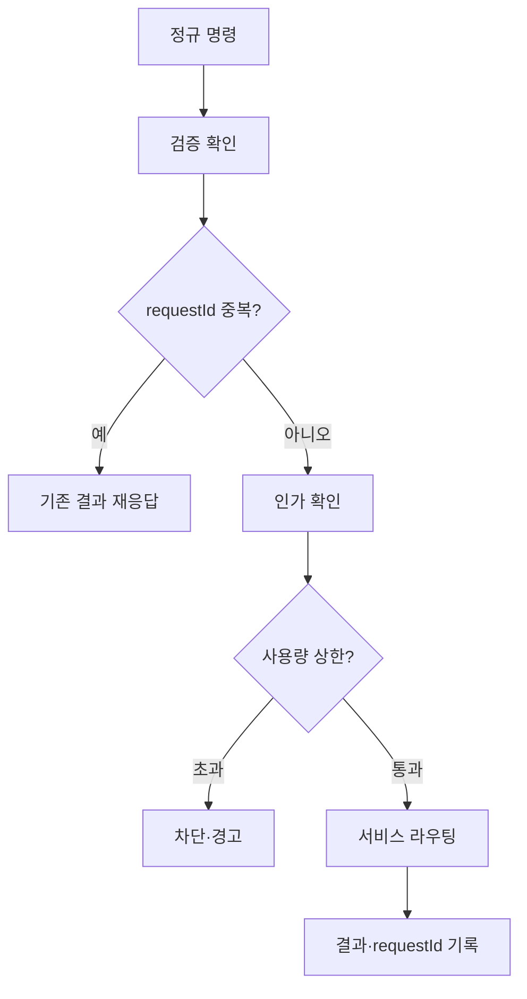

# 구성요소 상세개발계획서 — 17. Command 처리기

> 위치: `apps/server/src/core/command` · 레이어: 코어 · 단계: P1
> 관련 문서: 01(명령 형식) · 02(API) · 03(인가) · 05(SessionManager) · 08(스케줄러) · 10(어댑터)
> 본 문서는 코드를 포함하지 않는다.

## 1. 개요 및 책임
모든 인바운드 명령의 **단일 진입점 겸 디스패처**다. API 레이어와 채널 어댑터가 만든 정규 명령(NormalizedCommand)을 받아, (1)멱등성(중복) 판정, (2)필요 인가 확인, (3)적절한 코어 서비스로 라우팅, (4)사용량 상한 게이트 적용을 수행한다. 어떤 출처(웹/메신저)의 명령이든 여기로 수렴하므로, 출처 무관 일관 처리와 헤드리스 원칙이 이 지점에서 실현된다.

## 2. 범위
- 포함: 명령 수신·검증 확인, 멱등성 디둡, 인가 연계, 사용량 상한 게이트, 서비스 라우팅, 처리 결과 표준화.
- 제외: 실제 실행(05), 동시성 제어(08), 상태 전이 판정(07), 프로토콜 처리(02), 채널 번역(10).

## 3. 의존성
- 상위 호출자: API 레이어(REST), 채널 어댑터(인바운드).
- 하위 피호출자: 인증/인가(03), SessionManager(05), 스케줄러(08), 파일/Git/터미널 서비스(11/12/13), 데이터 모델(멱등성·사용량).
- 공유: `packages/shared`(명령/스코프/에러 형식).

## 4. 내부 구성 요소
| 구성 요소 | 역할 |
|---|---|
| 명령 수신기 | 정규 명령을 받아 형식 검증 결과를 확인 |
| 멱등성 관리기 | requestId 기준 중복 요청 판정·재응답 |
| 인가 연계기 | 명령 종류별 필요 스코프를 인가 판단기에 확인 |
| 사용량 게이트 | 예산/쿼터 상한 도달 시 차단·경고 |
| 라우터 | 명령 종류를 대상 서비스 동작으로 매핑·호출 |

## 5. 데이터 구조 및 필드

### 5.1 멱등성 기록 항목
| 필드 | 자료형 | 필수 | 의미 |
|---|---|---|---|
| requestId | 문자열 | 필수 | 명령의 고유 요청 식별자 |
| resultRef | 문자열 | 필수 | 최초 처리 결과 참조(재응답용) |
| createdAt | 시각 | 필수 | 기록 시각(만료 판정) |

### 5.2 명령→서비스 라우팅 표
| 명령 kind | 필요 스코프 | 대상 처리 |
|---|---|---|
| create_project | project:write | 프로젝트 생성(파일 서비스·Git 초기화) |
| create_session | prompt:send | SessionManager 세션 생성 |
| send_prompt | prompt:send | 사용량 게이트 → 스케줄러 enqueue |
| steer | prompt:send | SessionManager 추가 지시 |
| cancel | run:cancel | SessionManager/스케줄러 취소 |
| approve | approval:resolve | 승인 해소(상태머신) |
| status | project:read | 상태·인박스 조회 |
| exec_command | terminal:exec | ExecService runToCompletion (헤드리스 터미널) |

## 6. 기능(동작) 명세

### 6.1 명령 처리(주 경로)
- 목적: 정규 명령을 안전하게 실행으로 연결.
- 사전조건: 인증 컨텍스트가 이미 주입되어 있다(02/03).
- 처리 절차:
  1. 명령 형식 검증 결과를 확인한다(미검증이면 거부).
  2. **멱등성 판정**: requestId가 최근 기록에 있으면 실행하지 않고 기존 결과를 재응답한다.
  3. **인가 확인**: 라우팅 표의 필요 스코프를 인가 판단기로 확인한다(부족 시 거부).
  4. **사용량 게이트**: send_prompt 등 과금성 명령은 사용량 상한을 확인한다(초과 시 차단·경고 반환).
  5. **라우팅**: 명령 종류에 따라 대상 서비스 동작을 호출한다.
  6. 처리 결과와 requestId를 멱등성 기록에 저장한다.
- 사후조건: 동일 requestId 재요청은 중복 실행되지 않는다.
- 출력: 표준 처리 결과(성공/거부/차단, 관련 식별자).

### 6.2 멱등성 규칙
- requestId는 명령마다 유일해야 한다(01에서 필수).
- 기록은 보존 기간 이후 만료한다.
- 재응답 시 원래 결과 참조를 반환하여 부작용 재발생을 막는다.

### 6.3 사용량 게이트 규칙
- 사용자/프로젝트별 기간 사용량을 조회하여 상한과 비교한다.
- 임계 근접 시 경고, 초과 시 차단(관리자/사용자 설정에 따름).
- 게이트 통과 시에만 스케줄러로 넘긴다.

## 7. 처리 흐름

## 8. 상호작용
- API/어댑터: 명령 공급자(인증 컨텍스트 포함).
- 인가: 스코프 확인.
- 스케줄러: 실행성 명령을 enqueue로 위임.
- SessionManager/파일/Git/터미널: 명령별 실제 처리.
- 데이터 모델: 멱등성·사용량 조회/기록.

## 9. 예외/에러 처리
| 상황 | 결과 |
|---|---|
| 미검증 명령 | 거부(validation_failed) |
| 스코프 부족 | 거부(403) |
| 사용량 초과 | 차단(quota_exceeded) |
| 중복 requestId | 기존 결과 재응답(중복 실행 없음) |
| 라우팅 대상 오류 | 표준 에러로 변환·반환 |

## 10. 보안 고려사항
- 모든 실행성 명령은 인가 통과 후에만 라우팅한다.
- 멱등성으로 재시도·재전송에 의한 중복 부작용을 방지한다.
- 사용량 게이트로 자원/비용 남용을 차단한다.

## 11. 구성/설정값
- 멱등성 기록 보존 기간, 사용량 상한(사용자/프로젝트별), 경고 임계 비율.

## 12. 테스트 전략
- 동일 requestId 재요청 시 1회만 실행되는지.
- 명령별 필요 스코프 인가 정확성.
- 사용량 초과 시 차단·통과 경계.
- 라우팅 정확성(명령→서비스).

## 13. 개발 순서 / 완료 기준(DoD)
- P1 착수(API·스케줄러·SessionManager와 함께).
- DoD: 명령 검증→멱등성→인가→라우팅 완결, send_prompt가 스케줄러로 정상 전달, 중복 방지 동작.

## 14. 오픈 이슈
- 사용량 상한 정책의 소유(관리자 설정 vs 사용자 설정).
- 자연어 명령(어댑터에서 온)의 부분 실패 시 재질의 흐름.
